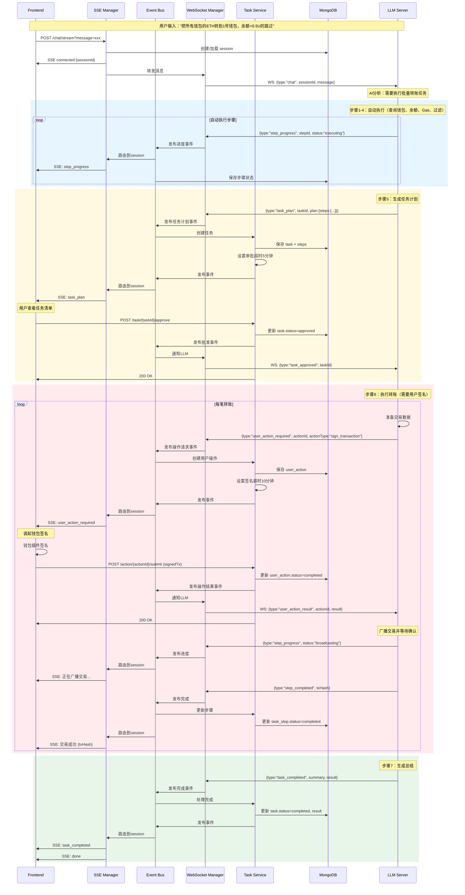

```mermaid
sequenceDiagram
    participant F as Frontend
    participant SSE as SSE Manager
    participant EB as Event Bus
    participant WS as WebSocket Manager
    participant TS as Task Service
    participant DB as MongoDB
    participant L as LLM Server

    Note over F,L: 用户输入："把所有钱包的ETH转到1号钱包，余额<0.5U的跳过"
    
    F->>SSE: POST /chat/stream?message=xxx
    SSE->>DB: 创建/加载 session
    SSE->>F: SSE connected {sessionId}
    SSE->>WS: 转发消息
    WS->>L: WS: {type:"chat", sessionId, message}
    
    Note over L: AI分析：需要执行批量转账任务
    
    rect rgb(230, 245, 255)
        Note over L: 步骤1-4：自动执行（查询钱包、余额、Gas、过滤）
        loop 自动执行步骤
            L->>WS: {type:"step_progress", stepId, status:"executing"}
            WS->>EB: 发布进度事件
            EB->>SSE: 路由到session
            SSE->>F: SSE: step_progress
            EB->>DB: 保存步骤状态
        end
    end
    
    rect rgb(255, 249, 225)
        Note over L: 步骤5：生成任务计划
        L->>WS: {type:"task_plan", taskId, plan:{steps:[...]}}
        WS->>EB: 发布任务计划事件
        EB->>TS: 创建任务
        TS->>DB: 保存 task + steps
        TS->>TS: 设置审批超时5分钟
        TS->>EB: 发布事件
        EB->>SSE: 路由到session
        SSE->>F: SSE: task_plan
        
        Note over F: 用户查看任务清单
        F->>TS: POST /task/{taskId}/approve
        TS->>DB: 更新 task.status=approved
        TS->>EB: 发布批准事件
        EB->>WS: 通知LLM
        WS->>L: WS: {type:"task_approved", taskId}
        TS->>F: 200 OK
    end
    
    rect rgb(255, 235, 238)
        Note over L: 步骤6：执行转账（需要用户签名）
        loop 每笔转账
            L->>L: 准备交易数据
            L->>WS: {type:"user_action_required", actionId, actionType:"sign_transaction"}
            WS->>EB: 发布操作请求事件
            EB->>TS: 创建用户操作
            TS->>DB: 保存 user_action
            TS->>TS: 设置签名超时10分钟
            TS->>EB: 发布事件
            EB->>SSE: 路由到session
            SSE->>F: SSE: user_action_required
            
            Note over F: 调起钱包签名
            F->>F: 钱包插件签名
            F->>TS: POST /action/{actionId}/submit {signedTx}
            TS->>DB: 更新 user_action.status=completed
            TS->>EB: 发布操作结果事件
            EB->>WS: 通知LLM
            WS->>L: WS: {type:"user_action_result", actionId, result}
            TS->>F: 200 OK
            
            Note over L: 广播交易并等待确认
            L->>WS: {type:"step_progress", status:"broadcasting"}
            WS->>EB: 发布进度
            EB->>SSE: 路由到session
            SSE->>F: SSE: 正在广播交易...
            
            L->>WS: {type:"step_completed", txHash}
            WS->>EB: 发布完成
            EB->>TS: 更新步骤
            TS->>DB: 更新 task_step.status=completed
            EB->>SSE: 路由到session
            SSE->>F: SSE: 交易成功 {txHash}
        end
    end
    
    rect rgb(232, 245, 233)
        Note over L: 步骤7：生成总结
        L->>WS: {type:"task_completed", summary, result}
        WS->>EB: 发布完成事件
        EB->>TS: 处理完成
        TS->>DB: 更新 task.status=completed, result
        TS->>EB: 发布事件
        EB->>SSE: 路由到session
        SSE->>F: SSE: task_completed
        SSE->>F: SSE: done
    end
```