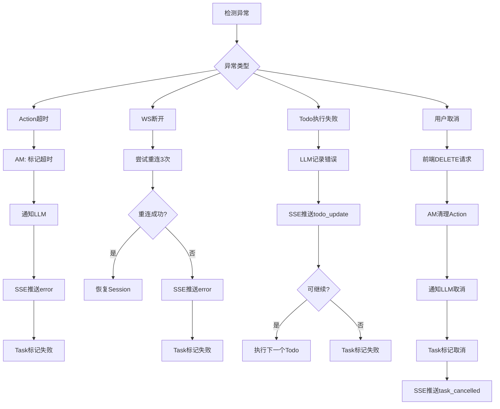

```mermaid
graph TD
    A[检测异常] --> B{异常类型}
    
    B --> C[Action超时]
    B --> D[WS断开]
    B --> E[Todo执行失败]
    B --> F[用户取消]
    
    C --> C1[AM: 标记超时]
    C1 --> C2[通知LLM]
    C2 --> C3[SSE推送error]
    C3 --> C4[Task标记失败]
    
    D --> D1[尝试重连3次]
    D1 --> D2{重连成功?}
    D2 -->|是| D3[恢复Session]
    D2 -->|否| D4[SSE推送error]
    D4 --> D5[Task标记失败]
    
    E --> E1[LLM记录错误]
    E1 --> E2[SSE推送todo_update]
    E2 --> E3{可继续?}
    E3 -->|是| E4[执行下一个Todo]
    E3 -->|否| E5[Task标记失败]
    
    F --> F1[前端DELETE请求]
    F1 --> F2[AM清理Action]
    F2 --> F3[通知LLM取消]
    F3 --> F4[Task标记取消]
    F4 --> F5[SSE推送task_cancelled]
```