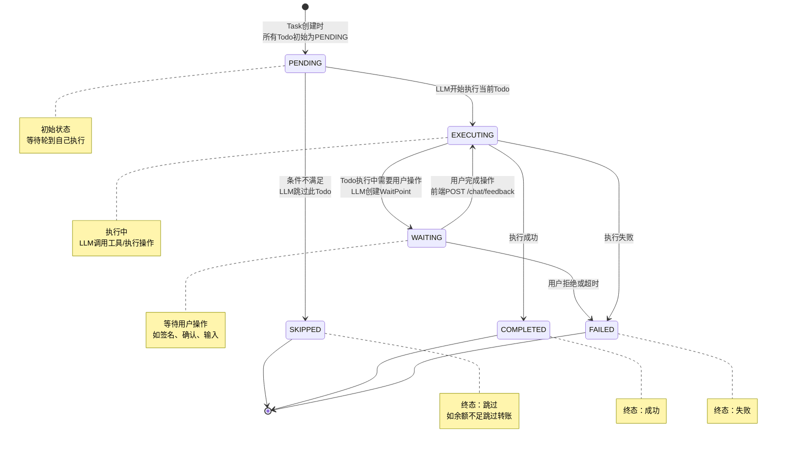

```mermaid
stateDiagram-v2
    [*] --> PENDING: Task创建时<br/>所有Todo初始为PENDING
    
    PENDING --> EXECUTING: LLM开始执行当前Todo
    PENDING --> SKIPPED: 条件不满足<br/>LLM跳过此Todo
    
    EXECUTING --> WAITING: Todo执行中需要用户操作<br/>LLM创建WaitPoint
    
    WAITING --> EXECUTING: 用户完成操作<br/>前端POST /chat/feedback
    WAITING --> FAILED: 用户拒绝或超时
    
    EXECUTING --> COMPLETED: 执行成功
    EXECUTING --> FAILED: 执行失败
    
    SKIPPED --> [*]
    COMPLETED --> [*]
    FAILED --> [*]
    
    note right of PENDING
        初始状态
        等待轮到自己执行
    end note
    
    note right of EXECUTING
        执行中
        LLM调用工具/执行操作
    end note
    
    note right of WAITING
        等待用户操作
        如签名、确认、输入
    end note
    
    note right of SKIPPED
        终态：跳过
        如余额不足跳过转账
    end note
    
    note right of COMPLETED
        终态：成功
    end note
    
    note right of FAILED
        终态：失败
    end note
```