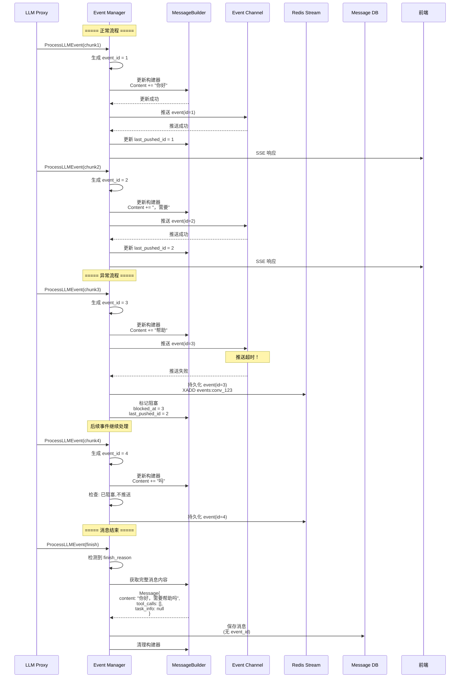

```mermaid
sequenceDiagram
    participant LP as LLM Proxy
    participant EM as Event Manager
    participant Builder as MessageBuilder
    participant CH as Event Channel
    participant Redis as Redis Stream
    participant DB as Message DB
    participant FE as 前端

    Note over EM: ===== 正常流程 =====
    
    LP->>EM: ProcessLLMEvent(chunk1)
    EM->>EM: 生成 event_id = 1
    EM->>Builder: 更新构建器<br/>Content += "你好"
    Builder-->>EM: 更新成功
    
    EM->>CH: 推送 event(id=1)
    CH-->>EM: 推送成功
    EM->>Builder: 更新 last_pushed_id = 1
    EM->>FE: SSE 响应
    
    LP->>EM: ProcessLLMEvent(chunk2)
    EM->>EM: 生成 event_id = 2
    EM->>Builder: 更新构建器<br/>Content += "，需要"
    EM->>CH: 推送 event(id=2)
    CH-->>EM: 推送成功
    EM->>Builder: 更新 last_pushed_id = 2
    EM->>FE: SSE 响应
    
    Note over EM: ===== 异常流程 =====
    
    LP->>EM: ProcessLLMEvent(chunk3)
    EM->>EM: 生成 event_id = 3
    EM->>Builder: 更新构建器<br/>Content += "帮助"
    EM->>CH: 推送 event(id=3)
    
    Note over CH: 推送超时！
    CH-->>EM: 推送失败
    
    EM->>Redis: 持久化 event(id=3)<br/>XADD events:conv_123
    EM->>Builder: 标记阻塞<br/>blocked_at = 3<br/>last_pushed_id = 2
    
    Note over EM: 后续事件继续处理
    
    LP->>EM: ProcessLLMEvent(chunk4)
    EM->>EM: 生成 event_id = 4
    EM->>Builder: 更新构建器<br/>Content += "吗"
    
    EM->>EM: 检查: 已阻塞,不推送
    EM->>Redis: 持久化 event(id=4)
    
    Note over EM: ===== 消息结束 =====
    
    LP->>EM: ProcessLLMEvent(finish)
    EM->>EM: 检测到 finish_reason
    
    EM->>Builder: 获取完整消息内容
    Builder-->>EM: Message{<br/>  content: "你好，需要帮助吗",<br/>  tool_calls: [],<br/>  task_info: null<br/>}
    
    EM->>DB: 保存消息<br/>(无 event_id)
    EM->>Builder: 清理构建器
```