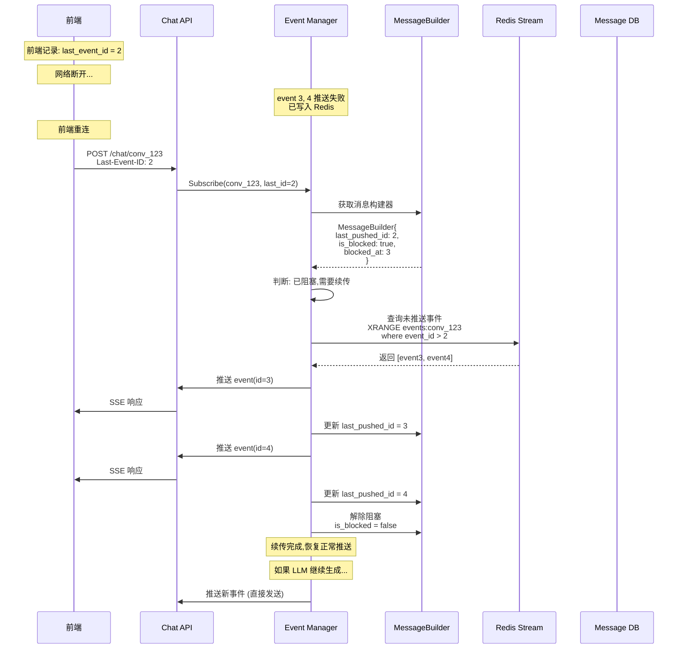

**判断逻辑伪代码：**
```
func (em *EventManager) Subscribe(convID string, lastEventID int64) {
    // 1. 检查是否有正在构建的消息
    builder := em.getMessageBuilder(convID)
    
    if builder == nil {
        // 场景1: 无正在生成的消息
        // 这是正常的新会话或消息已完成
        return em.createNewChannel(convID)
    }
    
    // 2. 检查是否阻塞
    if !builder.IsBlocked {
        // 场景2: 有正在生成的消息,但未阻塞
        // 说明推送一直正常,不需要续传
        // (这种情况理论上不应该发生,因为有正在生成的消息说明前端应该已连接)
        return em.createNewChannel(convID)
    }
    
    // 3. 场景3: 阻塞状态,需要续传
    if builder.IsBlocked {
        // 从 Redis 查询 event_id > builder.LastPushedID 的事件
        missedEvents := em.queryRedisEvents(convID, builder.LastPushedID)
        
        if len(missedEvents) == 0 {
            // 异常情况: Redis 中没有事件
            // 可能 Redis 数据已过期或丢失
            log.Error("No events found in Redis for replay")
            
            // 补偿方案: 直接解除阻塞,继续正常流程
            builder.IsBlocked = false
            return em.createNewChannel(convID)
        }
        
        // 创建 Channel 并启动续传
        ch := em.createNewChannel(convID)
        go em.replayEvents(convID, ch, missedEvents, builder)
        
        return ch
    }
}
```

---

### 4. 需要调整的设计文档部分

#### 4.1 修改 Event Manager 的职责

**原文档 3.1.1:**
```
Event Manager 是系统事件流转的核心枢纽，负责：
- 接收并转换LLM原始事件为标准Event
- 持久化Event到存储层
- 将Event分发给订阅者（Chat API）
- 支持断线续传
```

**修改为:**
```
Event Manager 是系统事件流转的核心枢纽，负责：
- 接收并转换LLM原始事件为标准Event
- 维护消息构建器 (MessageBuilder),边推送边合并事件
- 将Event分发给订阅者（Chat API）
- 推送失败时持久化Event到Redis（仅异常情况）
- 支持断线续传
- 在消息结束时触发保存到 Message DB
```

#### 4.2 修改 Persistence Module

**原文档职责:**
```
职责：
- 生成会话内递增的 event_id
- 将Event写入Redis Stream
- 维护Event ID序列
```

**修改为:**
```
职责：
- 生成会话内递增的 event_id (使用内存计数器)
- 仅在推送失败时将Event写入Redis Stream
- 不维护完整的事件序列,仅作为续传的临时缓冲
```

**核心方法修改:**
```
原: StoreEvent(event) → error (所有事件都存)
改: StoreEventOnFailure(event) → error (仅失败时存)
```

#### 4.3 新增 Message Builder Module

**在 3.1.6 模块设计中新增:**
```
##### Message Builder Module（消息构建器模块）

职责：
- 维护会话级的消息构建器
- 边推送边合并事件内容
- 记录推送状态 (last_pushed_id, is_blocked)
- 在消息结束时提供完整的消息对象用于保存

数据结构：
messageBuilders: sync.Map
Key: conversation_id (string)
Value: *MessageBuilder

MessageBuilder 结构：
  - conversation_id: string
  - message_id: string
  - content: StringBuilder (累加所有 LLM_CHUNK)
  - tool_calls: []ToolCall (收集 TOOL_CALL 事件)
  - task_info: *TaskPlan (保存 TASK_PLAN 事件)
  - last_pushed_id: int64 (推送状态)
  - is_blocked: bool (是否阻塞)
  - blocked_at: int64 (阻塞位置)

核心方法：
GetOrCreateBuilder(conversation_id, message_id) → *MessageBuilder
  1. 检查是否已存在构建器
  2. 不存在则创建新的
  3. 返回构建器引用

UpdateBuilder(conversation_id, event) → error
  1. 根据 event_type 更新对应字段:
     - LLM_CHUNK: 累加 content
     - TOOL_CALL: 追加到 tool_calls
     - TASK_PLAN: 保存到 task_info
  2. 增加 event_count

GetMessage(conversation_id) → *Message
  1. 获取构建器
  2. 构建完整的 Message 对象
  3. 不包含 event_id (DB 存储不需要)

ClearBuilder(conversation_id)
  1. 消息保存后清理构建器
  2. 释放内存

生命周期：
  - 创建: 收到第一个 LLM 事件时
  - 更新: 每个事件到达时
  - 读取: 消息结束时保存到 DB
  - 清理: 消息保存到 DB 后
```