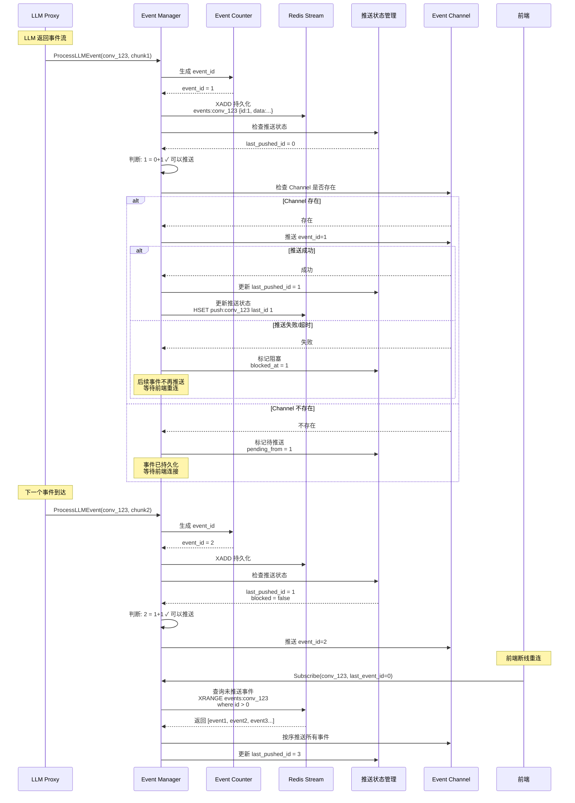

```mermaid
sequenceDiagram
    participant LP as LLM Proxy
    participant EM as Event Manager
    participant Counter as Event Counter
    participant Redis as Redis Stream
    participant StateMap as 推送状态管理
    participant CH as Event Channel
    participant FE as 前端

    Note over LP: LLM 返回事件流
    
    LP->>EM: ProcessLLMEvent(conv_123, chunk1)
    
    EM->>Counter: 生成 event_id
    Counter-->>EM: event_id = 1
    
    EM->>Redis: XADD 持久化<br/>events:conv_123 {id:1, data:...}
    
    EM->>StateMap: 检查推送状态
    StateMap-->>EM: last_pushed_id = 0
    
    EM->>EM: 判断: 1 = 0+1 ✓ 可以推送
    
    EM->>CH: 检查 Channel 是否存在
    
    alt Channel 存在
        CH-->>EM: 存在
        EM->>CH: 推送 event_id=1
        
        alt 推送成功
            CH-->>EM: 成功
            EM->>StateMap: 更新 last_pushed_id = 1
            EM->>Redis: 更新推送状态<br/>HSET push:conv_123 last_id 1
        else 推送失败/超时
            CH-->>EM: 失败
            EM->>StateMap: 标记阻塞<br/>blocked_at = 1
            Note over EM: 后续事件不再推送<br/>等待前端重连
        end
        
    else Channel 不存在
        CH-->>EM: 不存在
        EM->>StateMap: 标记待推送<br/>pending_from = 1
        Note over EM: 事件已持久化<br/>等待前端连接
    end
    
    Note over LP: 下一个事件到达
    
    LP->>EM: ProcessLLMEvent(conv_123, chunk2)
    EM->>Counter: 生成 event_id
    Counter-->>EM: event_id = 2
    
    EM->>Redis: XADD 持久化
    
    EM->>StateMap: 检查推送状态
    StateMap-->>EM: last_pushed_id = 1<br/>blocked = false
    
    EM->>EM: 判断: 2 = 1+1 ✓ 可以推送
    EM->>CH: 推送 event_id=2
    
    Note over FE: 前端断线重连
    
    FE->>EM: Subscribe(conv_123, last_event_id=0)
    
    EM->>Redis: 查询未推送事件<br/>XRANGE events:conv_123<br/>where id > 0
    
    Redis-->>EM: 返回 [event1, event2, event3...]
    
    EM->>CH: 按序推送所有事件
    
    EM->>StateMap: 更新 last_pushed_id = 3
```