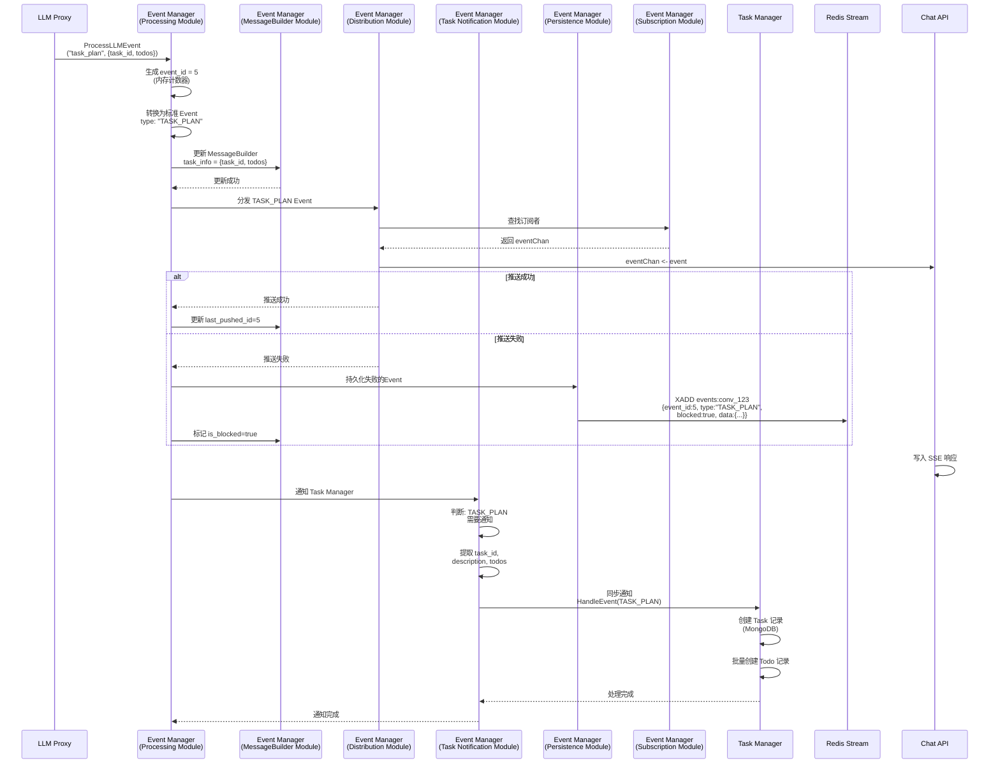

```mermaid
sequenceDiagram
    participant LLMProxy as LLM Proxy
    participant ProcMod as Event Manager<br/>(Processing Module)
    participant BuilderMod as Event Manager<br/>(MessageBuilder Module)
    participant DistribMod as Event Manager<br/>(Distribution Module)
    participant TaskNotifMod as Event Manager<br/>(Task Notification Module)
    participant PersistMod as Event Manager<br/>(Persistence Module)
    participant SubMod as Event Manager<br/>(Subscription Module)
    participant TaskMgr as Task Manager
    participant Redis as Redis Stream
    participant ChatAPI as Chat API

    LLMProxy->>ProcMod: ProcessLLMEvent<br/>("task_plan", {task_id, todos})

    ProcMod->>ProcMod: 生成 event_id = 5<br/>(内存计数器)
    
    ProcMod->>ProcMod: 转换为标准 Event<br/>type: "TASK_PLAN"
    
    ProcMod->>BuilderMod: 更新 MessageBuilder<br/>task_info = {task_id, todos}
    BuilderMod-->>ProcMod: 更新成功
    
    ProcMod->>DistribMod: 分发 TASK_PLAN Event
    DistribMod->>SubMod: 查找订阅者
    SubMod-->>DistribMod: 返回 eventChan
    DistribMod->>ChatAPI: eventChan <- event
    
    alt 推送成功
        DistribMod-->>ProcMod: 推送成功
        ProcMod->>BuilderMod: 更新 last_pushed_id=5
    else 推送失败
        DistribMod-->>ProcMod: 推送失败
        ProcMod->>PersistMod: 持久化失败的Event
        PersistMod->>Redis: XADD events:conv_123<br/>{event_id:5, type:"TASK_PLAN",<br/>blocked:true, data:{...}}
        ProcMod->>BuilderMod: 标记 is_blocked=true
    end
    
    ChatAPI->>ChatAPI: 写入 SSE 响应
    
    ProcMod->>TaskNotifMod:  通知 Task Manager
    TaskNotifMod->>TaskNotifMod: 判断: TASK_PLAN<br/>需要通知
    
    TaskNotifMod->>TaskNotifMod: 提取 task_id,<br/>description, todos
    
    TaskNotifMod->>TaskMgr: 同步通知<br/>HandleEvent(TASK_PLAN)
    TaskMgr->>TaskMgr: 创建 Task 记录<br/>(MongoDB)
    TaskMgr->>TaskMgr: 批量创建 Todo 记录
    TaskMgr-->>TaskNotifMod: 处理完成
    
    TaskNotifMod-->>ProcMod: 通知完成
```