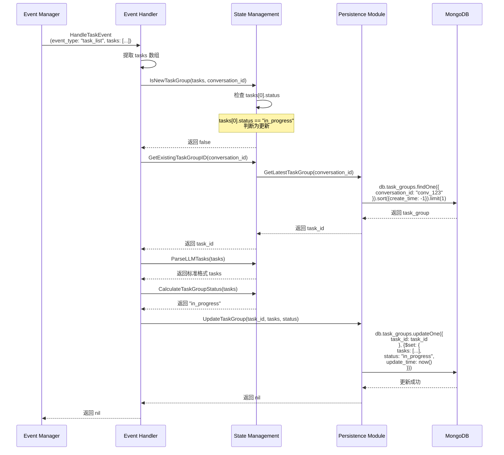

```mermaid
sequenceDiagram
    participant EM as Event Manager
    participant EH as Event Handler
    participant SM as State Management
    participant Persist as Persistence Module
    participant DB as MongoDB

    EM->>EH: HandleTaskEvent<br/>(event_type: "task_list", tasks: [...])
    
    EH->>EH: 提取 tasks 数组
    
    EH->>SM: IsNewTaskGroup(tasks, conversation_id)
    
    SM->>SM: 检查 tasks[0].status
    Note over SM: tasks[0].status == "in_progress"<br/>判断为更新
    SM-->>EH: 返回 false
    
    EH->>SM: GetExistingTaskGroupID(conversation_id)
    SM->>Persist: GetLatestTaskGroup(conversation_id)
    Persist->>DB: db.task_groups.findOne({<br/>  conversation_id: "conv_123"<br/>}).sort({create_time: -1}).limit(1)
    DB-->>Persist: 返回 task_group
    Persist-->>SM: 返回 task_id
    SM-->>EH: 返回 task_id
    
    EH->>SM: ParseLLMTasks(tasks)
    SM-->>EH: 返回标准格式 tasks
    
    EH->>SM: CalculateTaskGroupStatus(tasks)
    SM-->>EH: 返回 "in_progress"
    
    EH->>Persist: UpdateTaskGroup(task_id, tasks, status)
    Persist->>DB: db.task_groups.updateOne({<br/>  task_id: task_id<br/>}, {$set: {<br/>  tasks: [...],<br/>  status: "in_progress",<br/>  update_time: now()<br/>}})
    DB-->>Persist: 更新成功
    
    Persist-->>EH: 返回 nil
    EH-->>EM: 返回 nil
```