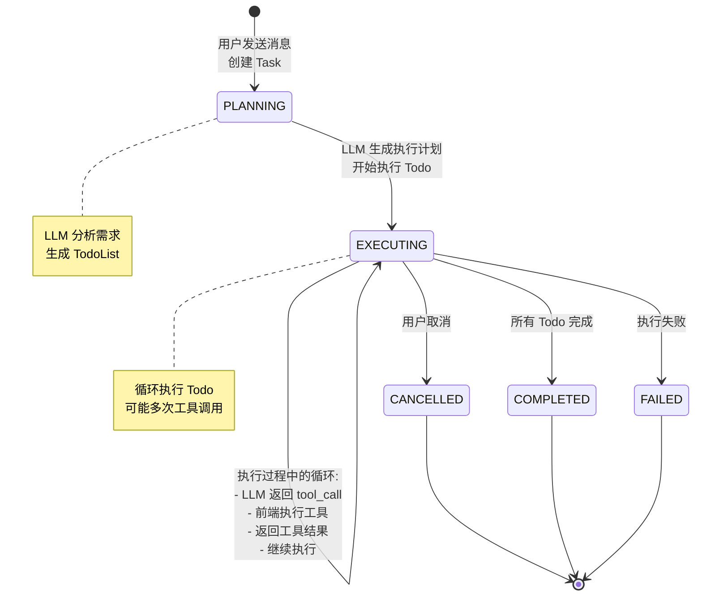

```mermaid
stateDiagram-v2
    [*] --> PLANNING: 用户发送消息<br/>创建 Task

    PLANNING --> EXECUTING: LLM 生成执行计划<br/>开始执行 Todo

    EXECUTING --> EXECUTING: 执行过程中的循环:<br/>- LLM 返回 tool_call<br/>- 前端执行工具<br/>- 返回工具结果<br/>- 继续执行

    EXECUTING --> COMPLETED: 所有 Todo 完成
    EXECUTING --> FAILED: 执行失败
    EXECUTING --> CANCELLED: 用户取消

    CANCELLED --> [*]
    COMPLETED --> [*]
    FAILED --> [*]

    note right of PLANNING
        LLM 分析需求
        生成 TodoList
    end note

    note right of EXECUTING
        循环执行 Todo
        可能多次工具调用
    end note
```