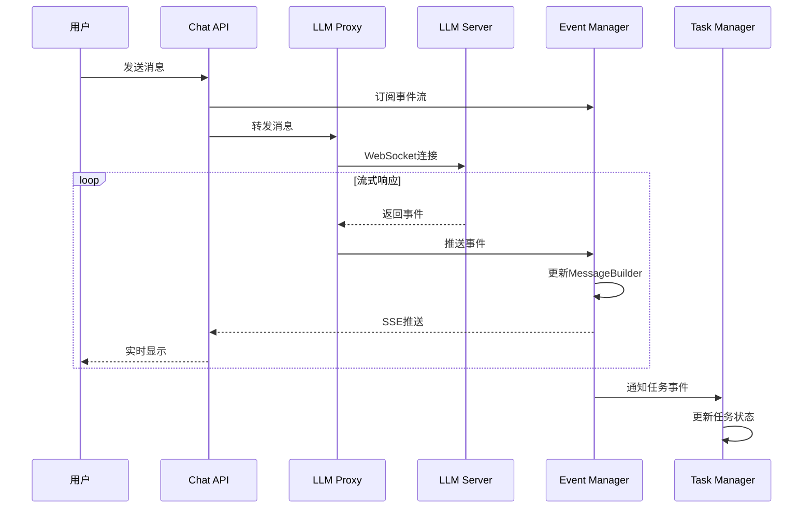

```mermaid
sequenceDiagram
    participant User as 用户
    participant API as Chat API
    participant Proxy as LLM Proxy
    participant LLM as LLM Server
    participant EM as Event Manager
    participant TM as Task Manager

    User->>API: 发送消息
    API->>EM: 订阅事件流
    API->>Proxy: 转发消息
    Proxy->>LLM: WebSocket连接
    
    loop 流式响应
        LLM-->>Proxy: 返回事件
        Proxy->>EM: 推送事件
        EM->>EM: 更新MessageBuilder
        EM-->>API: SSE推送
        API-->>User: 实时显示
    end
    
    EM->>TM: 通知任务事件
    TM->>TM: 更新任务状态
```