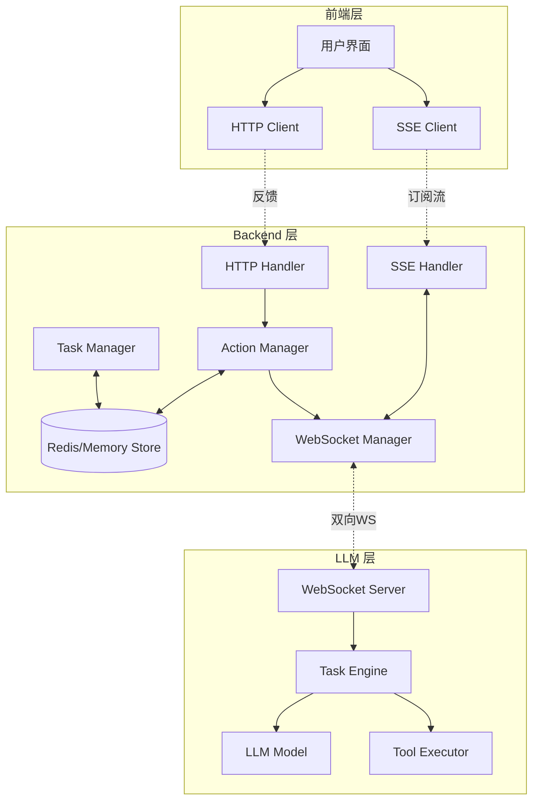

```mermaid
graph TB
    subgraph "前端层"
        UI[用户界面]
        SSE[SSE Client]
        HTTP[HTTP Client]
    end
    
    subgraph "Backend 层"
        direction TB
        SSE_Handler[SSE Handler]
        HTTP_Handler[HTTP Handler]
        WS_Manager[WebSocket Manager]
        Task_Mgr[Task Manager]
        Action_Mgr[Action Manager]
        Store[(Redis/Memory Store)]
    end
    
    subgraph "LLM 层"
        WS_Server[WebSocket Server]
        Task_Engine[Task Engine]
        Tool_Executor[Tool Executor]
        Model[LLM Model]
    end
    
    UI --> SSE
    UI --> HTTP
    
    SSE -.订阅流.-> SSE_Handler
    HTTP -.反馈.-> HTTP_Handler
    
    SSE_Handler <--> WS_Manager
    HTTP_Handler --> Action_Mgr
    Action_Mgr --> WS_Manager
    
    Task_Mgr <--> Store
    Action_Mgr <--> Store
    
    WS_Manager <-.双向WS.-> WS_Server
    WS_Server --> Task_Engine
    Task_Engine --> Tool_Executor
    Task_Engine --> Model
```