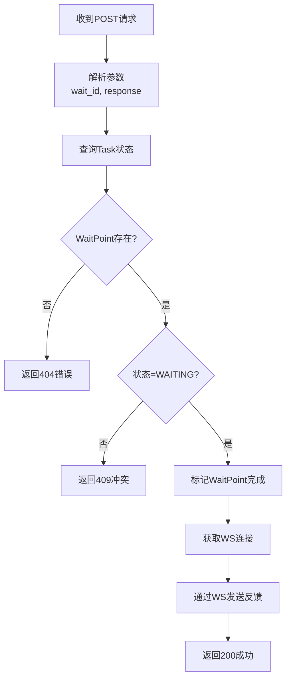

```mermaid
graph TD
    A[收到POST请求] --> B[解析参数<br/>wait_id, response]
    B --> C[查询Task状态]
    C --> D{WaitPoint存在?}
    D -->|否| E[返回404错误]
    D -->|是| F{状态=WAITING?}
    F -->|否| G[返回409冲突]
    F -->|是| H[标记WaitPoint完成]
    H --> I[获取WS连接]
    I --> J[通过WS发送反馈]
    J --> K[返回200成功]
```