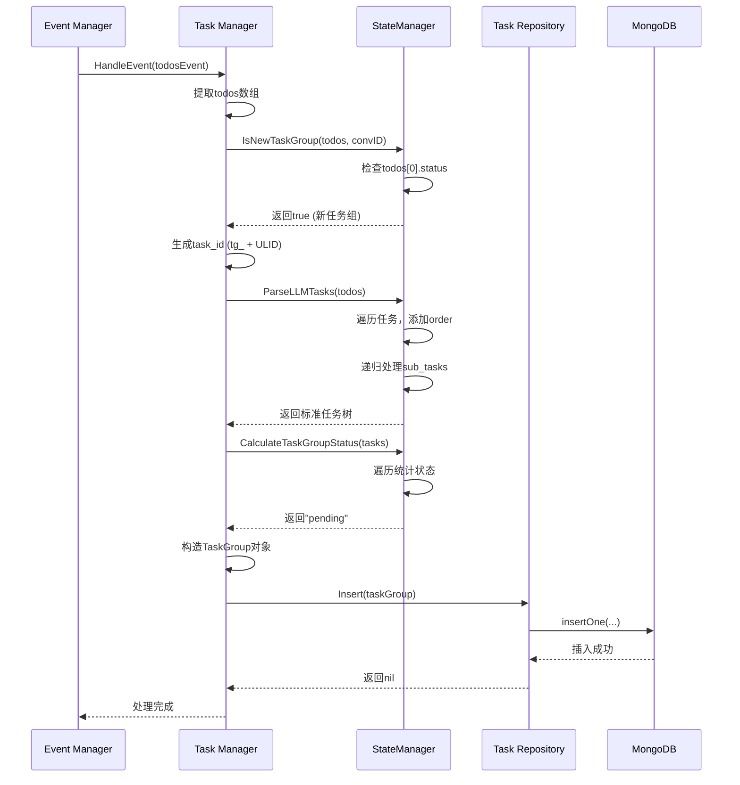

```mermaid
sequenceDiagram
    participant EM as Event Manager
    participant TM as Task Manager
    participant StateMgr as StateManager
    participant TaskRepo as Task Repository
    participant DB as MongoDB
    
    EM->>TM: HandleEvent(todosEvent)
    TM->>TM: 提取todos数组
    
    TM->>StateMgr: IsNewTaskGroup(todos, convID)
    StateMgr->>StateMgr: 检查todos[0].status
    StateMgr-->>TM: 返回true (新任务组)
    
    TM->>TM: 生成task_id (tg_ + ULID)
    
    TM->>StateMgr: ParseLLMTasks(todos)
    StateMgr->>StateMgr: 遍历任务，添加order
    StateMgr->>StateMgr: 递归处理sub_tasks
    StateMgr-->>TM: 返回标准任务树
    
    TM->>StateMgr: CalculateTaskGroupStatus(tasks)
    StateMgr->>StateMgr: 遍历统计状态
    StateMgr-->>TM: 返回"pending"
    
    TM->>TM: 构造TaskGroup对象
    
    TM->>TaskRepo: Insert(taskGroup)
    TaskRepo->>DB: insertOne(...)
    DB-->>TaskRepo: 插入成功
    TaskRepo-->>TM: 返回nil
    
    TM-->>EM: 处理完成
```