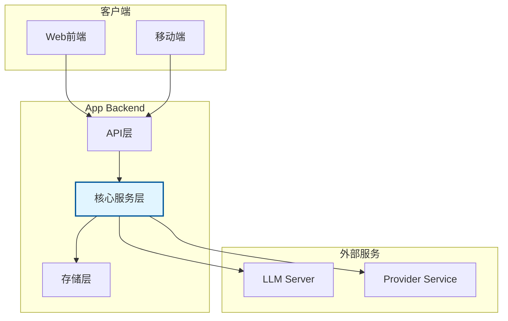

```mermaid
graph TB
    subgraph "客户端"
        Web[Web前端]
        Mobile[移动端]
    end

    subgraph "App Backend"
        API[API层]
        Core[核心服务层]
        Storage[存储层]
    end

    subgraph "外部服务"
        LLM[LLM Server]
        Provider[Provider Service]
    end

    Web --> API
    Mobile --> API
    
    API --> Core
    Core --> Storage
    Core --> LLM
    Core --> Provider

    style Core fill:#e1f5ff,stroke:#01579b,stroke-width:2px
```