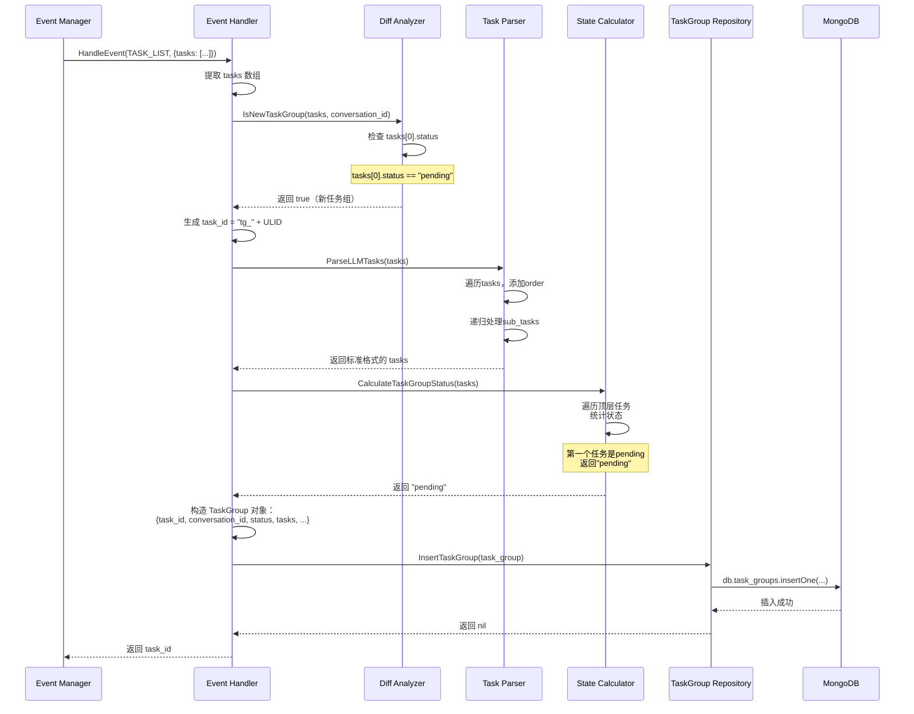

```mermaid
sequenceDiagram
    participant EM as Event Manager
    participant EH as Event Handler
    participant DA as Diff Analyzer
    participant TP as Task Parser
    participant SC as State Calculator
    participant Repo as TaskGroup Repository
    participant DB as MongoDB

    EM->>EH: HandleEvent(TASK_LIST, {tasks: [...]})
    
    EH->>EH: 提取 tasks 数组
    EH->>DA: IsNewTaskGroup(tasks, conversation_id)
    
    DA->>DA: 检查 tasks[0].status
    Note over DA: tasks[0].status == "pending"
    DA-->>EH: 返回 true（新任务组）
    
    EH->>EH: 生成 task_id = "tg_" + ULID
    
    EH->>TP: ParseLLMTasks(tasks)
    TP->>TP: 遍历tasks，添加order
    TP->>TP: 递归处理sub_tasks
    TP-->>EH: 返回标准格式的 tasks
    
    EH->>SC: CalculateTaskGroupStatus(tasks)
    SC->>SC: 遍历顶层任务<br/>统计状态
    Note over SC: 第一个任务是pending<br/>返回"pending"
    SC-->>EH: 返回 "pending"
    
    EH->>EH: 构造 TaskGroup 对象：<br/>{task_id, conversation_id, status, tasks, ...}
    
    EH->>Repo: InsertTaskGroup(task_group)
    Repo->>DB: db.task_groups.insertOne(...)
    DB-->>Repo: 插入成功
    
    Repo-->>EH: 返回 nil
    EH-->>EM: 返回 task_id
```