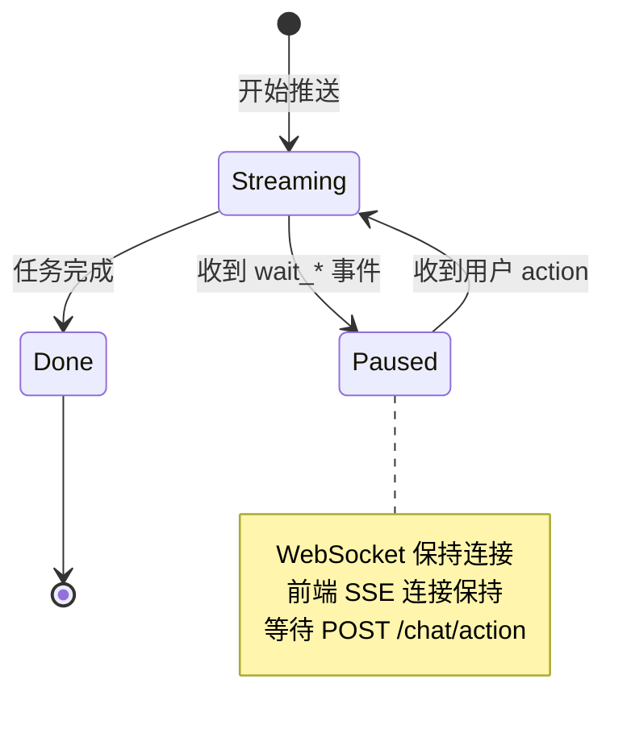

```mermaid
stateDiagram-v2
    [*] --> Streaming: 开始推送
    Streaming --> Paused: 收到 wait_* 事件
    Paused --> Streaming: 收到用户 action
    Streaming --> Done: 任务完成
    Done --> [*]
    
    note right of Paused
        WebSocket 保持连接
        前端 SSE 连接保持
        等待 POST /chat/action
    end note
```