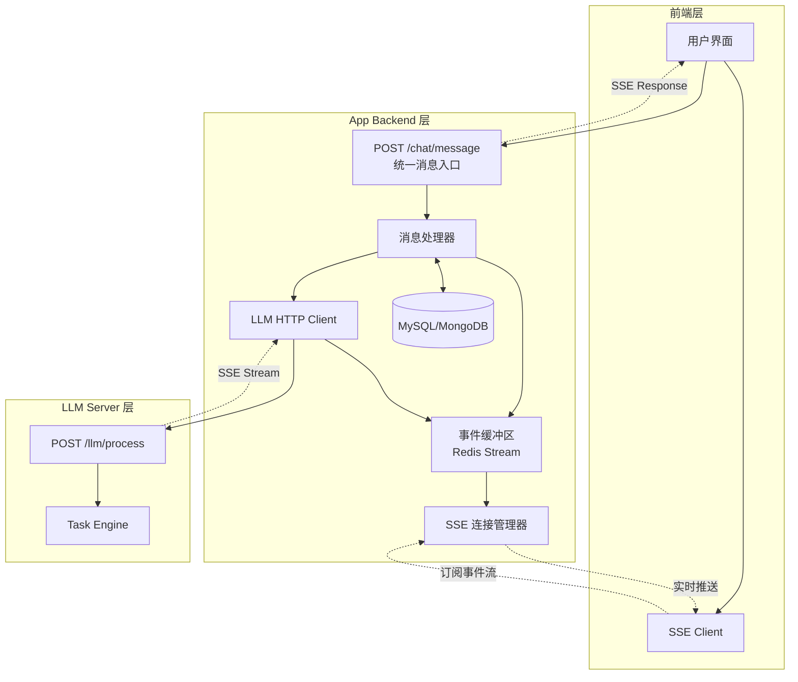

### 核心改进点

1. **统一入口 + SSE 响应**：`POST /chat/message` 同时支持 HTTP 请求和 SSE 响应
2. **事件缓冲区**：使用 Redis Stream 作为事件缓冲，支持续传和多端同步
3. **LLM Server 无续传参数**：`POST /llm/process` 不需要 `last_event_id`，续传由 App Backend 处理
4. **简化 Event Manager**：拆分为 SSE 连接管理器 + 事件缓冲区

---

# 二、接口设计

## 2.1 前端 → App Backend（唯一接口）
```
POST /api/v1/chat/message
Content-Type: application/json
Accept: text/event-stream
```