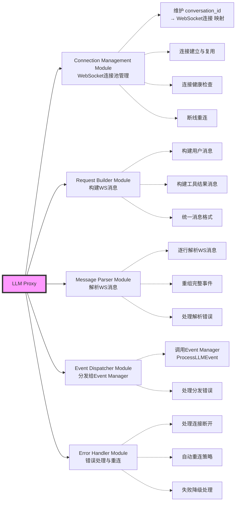

#### 2.2.2 核心数据结构

**Connection Management Module 数据结构**：
```
WSConnectionPool:
  类型：sync.Map
  Key：conversation_id (string)
  Value：*WSConnection
  
  WSConnection 结构：
    - conversation_id: string
    - conn: *websocket.Conn
    - message_queue: chan WSMessage (发送队列，缓冲100)
    - is_alive: bool
    - last_active: time.Time
    - reconnect_count: int
    - mu: sync.Mutex
```

**WebSocket 消息格式**（App Backend ↔ LLM Server）：
```
发送方向（App Backend → LLM Server）：
{
  "type": "user_message" | "tool_result",
  "data": {
    // type = user_message
    "content": "帮我查询余额",
    "enabled_providers": [...]
    
    // type = tool_result
    "tool_results": [
      {"call_id": "xxx", "content": "..."}
    ]
  }
}

接收方向（LLM Server → App Backend）：
保持与原设计一致的事件格式：
{
  "type": "content_chunk" | "tool_call" | "task_plan" | "end",
  "data": {...}
}
```

#### 2.2.3 核心方法设计

**Connection Management Module**：
```
GetOrCreateConnection(conversation_id) → *WSConnection
  职责：获取或创建到 LLM Server 的 WebSocket 连接
  
  流程：
    1. 从连接池查找 conversation_id
    2. 如果存在且连接健康，返回
    3. 如果不存在或连接断开：
       a. 建立 WebSocket 连接到 ws://llm-server/chat/{conversation_id}
       b. 创建 WSConnection 对象
       c. 启动发送协程（从 message_queue 读取消息发送）
       d. 启动接收协程（接收 LLM 事件，分发到 Event Manager）
       e. 存入连接池
    4. 返回连接对象

CloseConnection(conversation_id)
  职责：关闭指定会话的 WebSocket 连接
  
  触发时机：
    - 会话长时间无活动（15分钟超时）
    - 收到 LLM Server 的会话结束信号
    - 系统主动清理

HandleDisconnect(conversation_id, error)
  职责：处理连接意外断开
  
  策略：
    1. 记录断开原因和时间
    2. 判断是否需要重连：
       - MessageBuilder 中该会话是否有进行中的消息
       - 重连次数是否超过上限（3次）
    3. 如果需要重连：
       a. 执行指数退避重连（1s, 2s, 4s）
       b. 重连成功后，检查是否需要续传（见续传设计）
    4. 如果不重连：
       - 标记连接为失效
       - 清理连接池
```

**Request Builder Module**：
```
BuildUserMessage(conversation_id, content, providers) → WSMessage
  职责：构建用户消息
  
  输出：
    {
      "type": "user_message",
      "data": {
        "content": content,
        "enabled_providers": providers
      }
    }

BuildToolResult(conversation_id, tool_results) → WSMessage
  职责：构建工具结果消息
  
  输出：
    {
      "type": "tool_result",
      "data": {
        "tool_results": tool_results
      }
    }
```

**Message Parser Module**（与原 SSE Parser 类似）：
```
ParseWSMessage(rawMessage) → LLMEvent
  职责：解析 LLM Server 发来的 WebSocket 消息
  
  流程：
    1. JSON 反序列化
    2. 提取 type 和 data
    3. 验证消息格式
    4. 返回标准化的 LLMEvent
```

#### 2.2.4 对外接口调整

**对 Chat API 的接口**：
```
SendUserMessage(conversation_id, content, providers) → error
  变化：内部不再建立 HTTP 连接，改为：
  
  流程：
    1. 构建 WSMessage（通过 Request Builder）
    2. 获取或创建 WebSocket 连接
    3. 将消息发送到 message_queue
    4. 立即返回（非阻塞）
```

**对 Tool API 的接口**：
```
SendToolResult(conversation_id, tool_results) → error
  变化：不再是独立的 HTTP POST，改为：
  
  流程：
    1. 构建 WSMessage
    2. 从连接池获取已存在的连接（必然存在，因为是工具调用后的响应）
    3. 将消息发送到 message_queue
    4. 立即返回
```