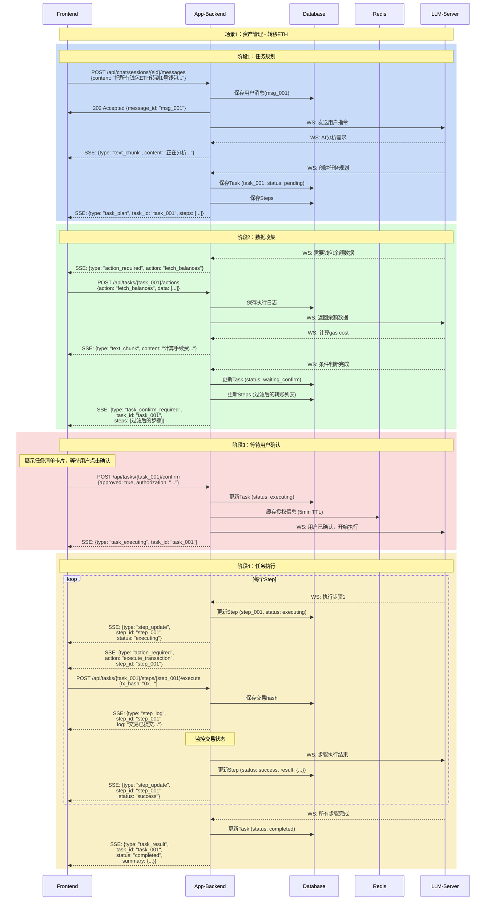

```mermaid
sequenceDiagram
    participant F as Frontend
    participant AB as App-Backend
    participant DB as Database
    participant Redis as Redis
    participant LLM as LLM-Server
    
    Note over F,LLM: 场景1：资产管理 - 转移ETH
    
    rect rgb(200, 220, 250)
        Note over F,LLM: 阶段1：任务规划
        F->>AB: POST /api/chat/sessions/{sid}/messages<br/>{content: "把所有钱包ETH转到1号钱包..."}
        AB->>DB: 保存用户消息(msg_001)
        AB->>F: 202 Accepted {message_id: "msg_001"}
        
        AB->>LLM: WS: 发送用户指令
        LLM-->>AB: WS: AI分析需求
        AB-->>F: SSE: {type: "text_chunk", content: "正在分析..."}
        
        LLM-->>AB: WS: 创建任务规划
        AB->>DB: 保存Task (task_001, status: pending)
        AB->>DB: 保存Steps
        AB-->>F: SSE: {type: "task_plan", task_id: "task_001", steps: [...]}
    end
    
    rect rgb(220, 250, 220)
        Note over F,LLM: 阶段2：数据收集
        LLM-->>AB: WS: 需要钱包余额数据
        AB-->>F: SSE: {type: "action_required", action: "fetch_balances"}
        
        F->>AB: POST /api/tasks/{task_001}/actions<br/>{action: "fetch_balances", data: [...]}
        AB->>DB: 保存执行日志
        AB->>LLM: WS: 返回余额数据
        
        LLM-->>AB: WS: 计算gas cost
        AB-->>F: SSE: {type: "text_chunk", content: "计算手续费..."}
        
        LLM-->>AB: WS: 条件判断完成
        AB->>DB: 更新Task (status: waiting_confirm)
        AB->>DB: 更新Steps (过滤后的转账列表)
        AB-->>F: SSE: {type: "task_confirm_required", <br/>task_id: "task_001", <br/>steps: [过滤后的步骤]}
    end
    
    rect rgb(250, 220, 220)
        Note over F,LLM: 阶段3：等待用户确认
        Note over F: 展示任务清单卡片，等待用户点击确认
        
        F->>AB: POST /api/tasks/{task_001}/confirm<br/>{approved: true, authorization: "..."}
        AB->>DB: 更新Task (status: executing)
        AB->>Redis: 缓存授权信息 (5min TTL)
        AB->>LLM: WS: 用户已确认，开始执行
        AB-->>F: SSE: {type: "task_executing", task_id: "task_001"}
    end
    
    rect rgb(250, 240, 200)
        Note over F,LLM: 阶段4：任务执行
        loop 每个Step
            LLM-->>AB: WS: 执行步骤1
            AB->>DB: 更新Step (step_001, status: executing)
            AB-->>F: SSE: {type: "step_update", <br/>step_id: "step_001", <br/>status: "executing"}
            
            AB-->>F: SSE: {type: "action_required", <br/>action: "execute_transaction", <br/>step_id: "step_001"}
            
            F->>AB: POST /api/tasks/{task_001}/steps/{step_001}/execute<br/>{tx_hash: "0x..."}
            AB->>DB: 保存交易hash
            AB-->>F: SSE: {type: "step_log", <br/>step_id: "step_001", <br/>log: "交易已提交..."}
            
            Note over AB: 监控交易状态
            AB->>LLM: WS: 步骤执行结果
            AB->>DB: 更新Step (status: success, result: {...})
            AB-->>F: SSE: {type: "step_update", <br/>step_id: "step_001", <br/>status: "success"}
        end
        
        LLM-->>AB: WS: 所有步骤完成
        AB->>DB: 更新Task (status: completed)
        AB-->>F: SSE: {type: "task_result", <br/>task_id: "task_001", <br/>status: "completed", <br/>summary: {...}}
    end
```