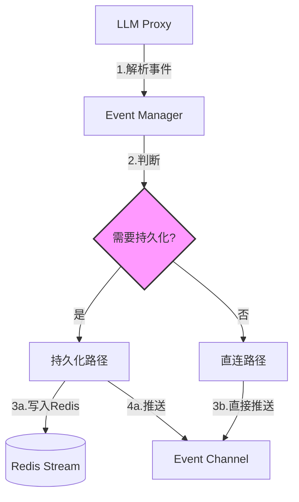

```mermaid
graph TB
    LLMProxy[LLM Proxy]
    EventMgr[Event Manager]
    Channel[Event Channel]
    Redis[(Redis Stream)]
    
    LLMProxy -->|1.解析事件| EventMgr
    EventMgr -->|2.判断| Decision{需要持久化?}
    
    Decision -->|是| PersistPath[持久化路径]
    Decision -->|否| DirectPath[直连路径]
    
    PersistPath -->|3a.写入Redis| Redis
    PersistPath -->|4a.推送| Channel
    
    DirectPath -->|3b.直接推送| Channel
    
    style Decision fill:#f9f,stroke:#333,stroke-width:2px
```