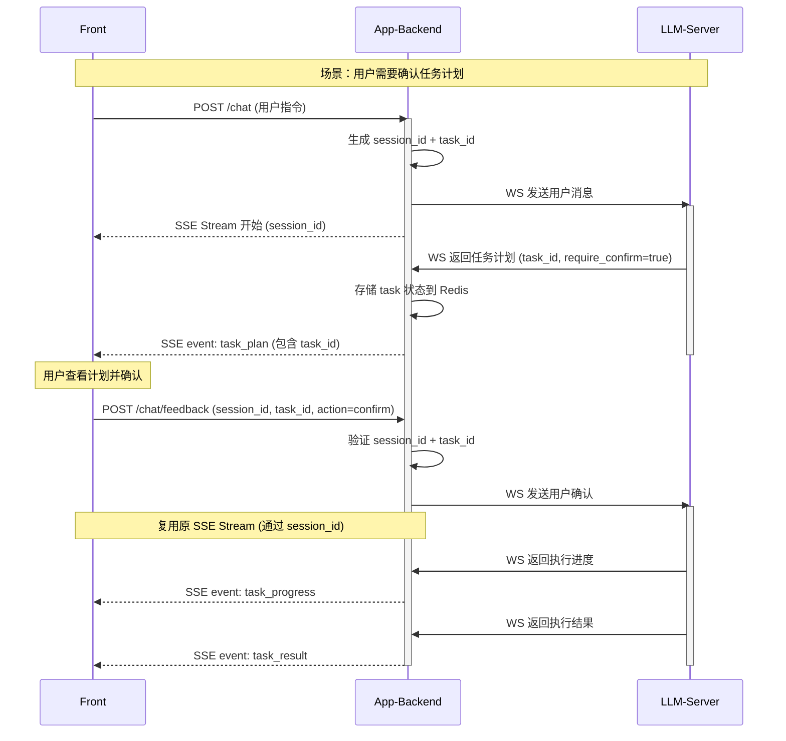

```mermaid
sequenceDiagram
    participant F as Front
    participant B as App-Backend
    participant L as LLM-Server
    
    Note over F,L: 场景：用户需要确认任务计划
    
    F->>B: POST /chat (用户指令)
    activate B
    B->>B: 生成 session_id + task_id
    B->>L: WS 发送用户消息
    activate L
    B-->>F: SSE Stream 开始 (session_id)
    
    L->>B: WS 返回任务计划 (task_id, require_confirm=true)
    B->>B: 存储 task 状态到 Redis
    B-->>F: SSE event: task_plan (包含 task_id)
    deactivate L
    
    Note over F: 用户查看计划并确认
    
    F->>B: POST /chat/feedback (session_id, task_id, action=confirm)
    B->>B: 验证 session_id + task_id
    B->>L: WS 发送用户确认
    activate L
    Note over B,F: 复用原 SSE Stream (通过 session_id)
    
    L->>B: WS 返回执行进度
    B-->>F: SSE event: task_progress
    L->>B: WS 返回执行结果
    B-->>F: SSE event: task_result
    deactivate L
    deactivate B
```