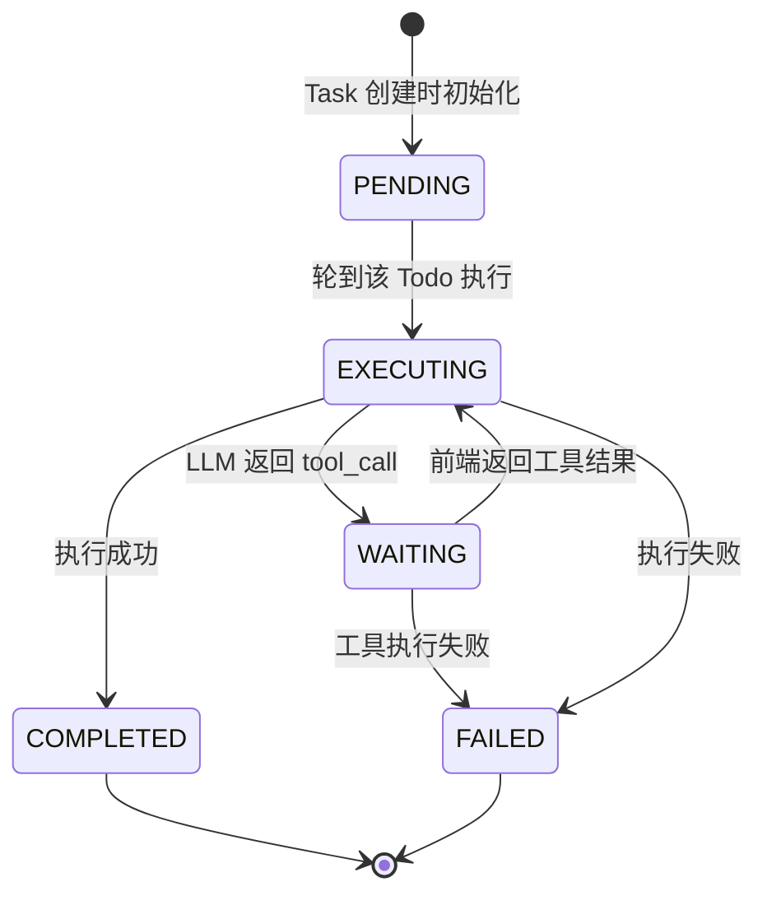

```mermaid
stateDiagram-v2
    [*] --> PENDING: Task 创建时初始化

    PENDING --> EXECUTING: 轮到该 Todo 执行

    EXECUTING --> WAITING: LLM 返回 tool_call
    WAITING --> EXECUTING: 前端返回工具结果
    WAITING --> FAILED: 工具执行失败

    EXECUTING --> COMPLETED: 执行成功
    EXECUTING --> FAILED: 执行失败

    COMPLETED --> [*]
    FAILED --> [*]
```