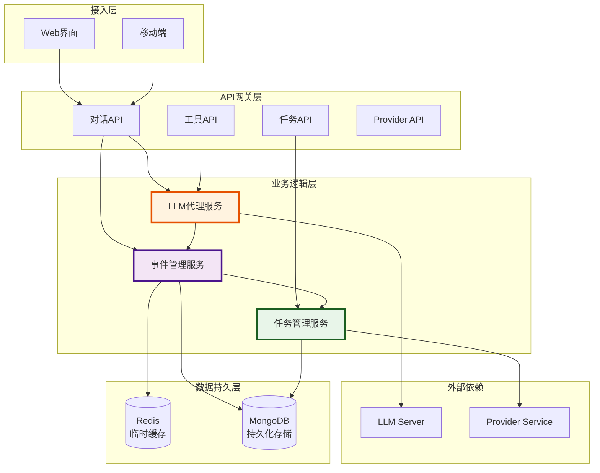

```mermaid
graph TB
    subgraph "接入层"
        WebUI[Web界面]
        MobileUI[移动端]
    end

    subgraph "API网关层"
        ChatAPI[对话API]
        ToolAPI[工具API]
        TaskAPI[任务API]
        ProviderAPI[Provider API]
    end

    subgraph "业务逻辑层"
        LLMProxy[LLM代理服务]
        EventMgr[事件管理服务]
        TaskMgr[任务管理服务]
    end

    subgraph "数据持久层"
        Redis[(Redis<br/>临时缓存)]
        MongoDB[(MongoDB<br/>持久化存储)]
    end

    subgraph "外部依赖"
        LLMServer[LLM Server]
        ProviderSvc[Provider Service]
    end

    WebUI --> ChatAPI
    MobileUI --> ChatAPI
    ChatAPI --> EventMgr
    ChatAPI --> LLMProxy
    ToolAPI --> LLMProxy
    TaskAPI --> TaskMgr
    
    LLMProxy --> LLMServer
    LLMProxy --> EventMgr
    EventMgr --> TaskMgr
    EventMgr --> Redis
    EventMgr --> MongoDB
    TaskMgr --> MongoDB
    TaskMgr --> ProviderSvc

    style EventMgr fill:#f3e5f5,stroke:#4a148c,stroke-width:3px
    style LLMProxy fill:#fff3e0,stroke:#e65100,stroke-width:3px
    style TaskMgr fill:#e8f5e9,stroke:#1b5e20,stroke-width:3px
```