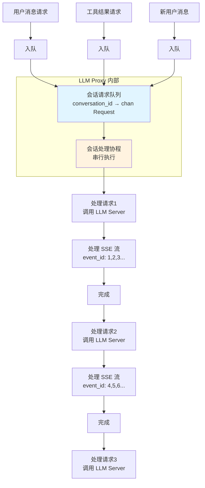

```mermaid
graph TB
    subgraph "LLM Proxy 内部"
        Queue[会话请求队列<br/>conversation_id → chan Request]
        Worker[会话处理协程<br/>串行执行]
    end
    
    Req1[用户消息请求]
    Req2[工具结果请求]
    Req3[新用户消息]
    
    Req1 --> Enqueue1[入队]
    Req2 --> Enqueue2[入队]
    Req3 --> Enqueue3[入队]
    
    Enqueue1 --> Queue
    Enqueue2 --> Queue
    Enqueue3 --> Queue
    
    Queue --> Worker
    
    Worker --> Process1[处理请求1<br/>调用 LLM Server]
    Process1 --> Stream1[处理 SSE 流<br/>event_id: 1,2,3...]
    Stream1 --> Done1[完成]
    
    Done1 --> Process2[处理请求2<br/>调用 LLM Server]
    Process2 --> Stream2[处理 SSE 流<br/>event_id: 4,5,6...]
    Stream2 --> Done2[完成]
    
    Done2 --> Process3[处理请求3<br/>调用 LLM Server]
    
    style Queue fill:#e1f5ff
    style Worker fill:#fff3e0
```