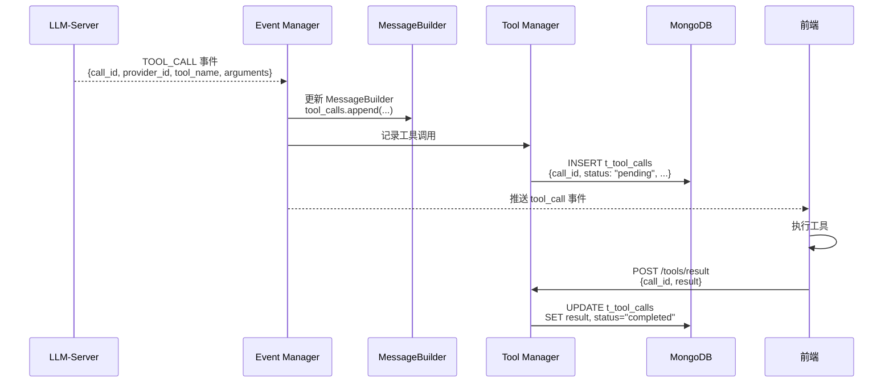

```mermaid
sequenceDiagram
    participant LLM as LLM-Server
    participant EM as Event Manager
    participant Builder as MessageBuilder
    participant ToolMgr as Tool Manager
    participant DB as MongoDB
    participant FE as 前端

    LLM-->>EM: TOOL_CALL 事件<br/>{call_id, provider_id, tool_name, arguments}
    
    EM->>Builder: 更新 MessageBuilder<br/>tool_calls.append(...)
    
    EM->>ToolMgr: 记录工具调用
    
    ToolMgr->>DB: INSERT t_tool_calls<br/>{call_id, status: "pending", ...}
    
    EM-->>FE: 推送 tool_call 事件
    
    FE->>FE: 执行工具
    
    FE->>ToolMgr: POST /tools/result<br/>{call_id, result}
    
    ToolMgr->>DB: UPDATE t_tool_calls<br/>SET result, status="completed"
```