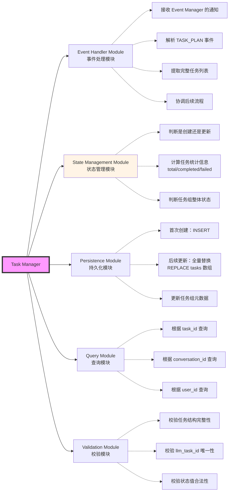

```mermaid
graph LR
    TM[Task Manager]
    
    TM --> EHM[Event Handler Module<br/>事件处理模块]
    TM --> SMM[State Management Module<br/>状态管理模块]
    TM --> PM[Persistence Module<br/>持久化模块]
    TM --> QM[Query Module<br/>查询模块]
    TM --> VM[Validation Module<br/>校验模块]
    
    EHM -.-> EHM1[接收 Event Manager 的通知]
    EHM -.-> EHM2[解析 TASK_PLAN 事件]
    EHM -.-> EHM3[提取完整任务列表]
    EHM -.-> EHM4[协调后续流程]
    
    SMM -.-> SMM1[判断是创建还是更新]
    SMM -.-> SMM2[计算任务统计信息<br/>total/completed/failed]
    SMM -.-> SMM3[判断任务组整体状态]
    
    VM -.-> VM1[校验任务结构完整性]
    VM -.-> VM2[校验 llm_task_id 唯一性]
    VM -.-> VM3[校验状态值合法性]

    PM -.-> PM1[首次创建：INSERT]
    PM -.-> PM2[后续更新：全量替换<br/>REPLACE tasks 数组]
    PM -.-> PM3[更新任务组元数据]
    
    QM -.-> QM1[根据 task_id 查询]
    QM -.-> QM2[根据 conversation_id 查询]
    QM -.-> QM3[根据 user_id 查询]
    
    style TM fill:#f9f,stroke:#333,stroke-width:4px
    style SMM fill:#fff4e6
```