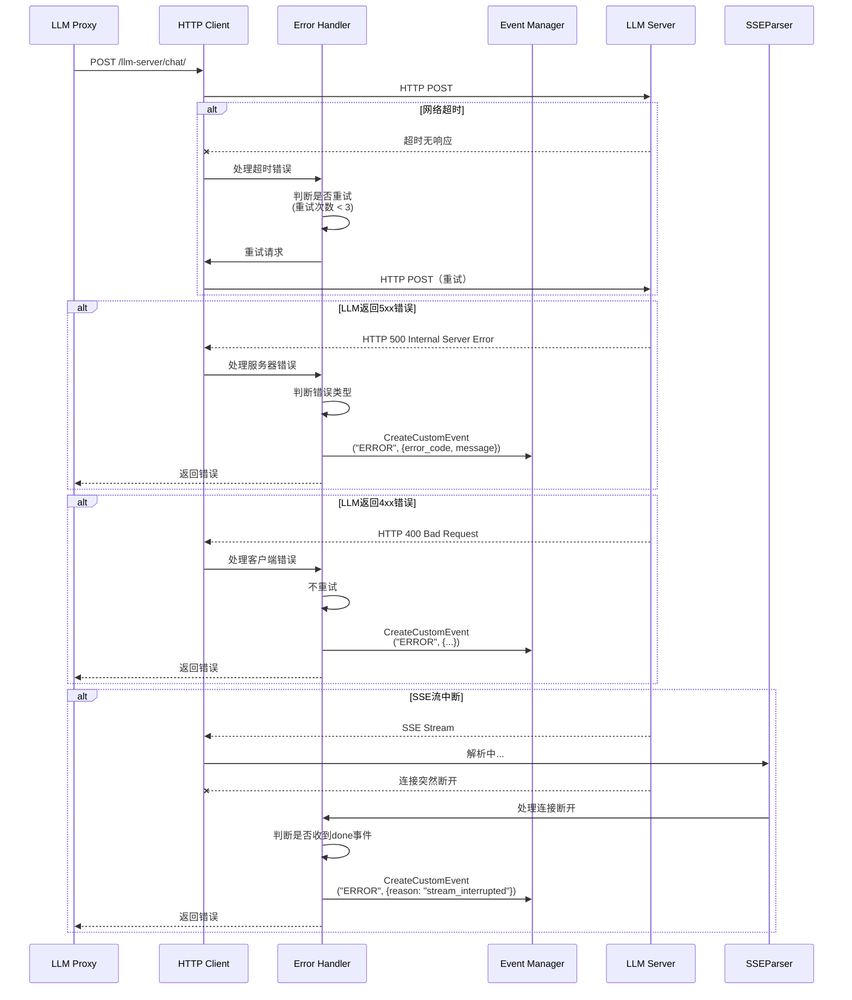

```mermaid
sequenceDiagram
    participant LLMProxy as LLM Proxy
    participant HTTPClient as HTTP Client
    participant ErrorHandler as Error Handler
    participant EventMgr as Event Manager
    participant LLM as LLM Server

    LLMProxy->>HTTPClient: POST /llm-server/chat/
    HTTPClient->>LLM: HTTP POST
    
    alt 网络超时
        LLM--xHTTPClient: 超时无响应
        HTTPClient->>ErrorHandler: 处理超时错误
        ErrorHandler->>ErrorHandler: 判断是否重试<br/>(重试次数 < 3)
        ErrorHandler->>HTTPClient: 重试请求
        HTTPClient->>LLM: HTTP POST（重试）
    end
    
    alt LLM返回5xx错误
        LLM-->>HTTPClient: HTTP 500 Internal Server Error
        HTTPClient->>ErrorHandler: 处理服务器错误
        ErrorHandler->>ErrorHandler: 判断错误类型
        ErrorHandler->>EventMgr: CreateCustomEvent<br/>("ERROR", {error_code, message})
        ErrorHandler-->>LLMProxy: 返回错误
    end
    
    alt LLM返回4xx错误
        LLM-->>HTTPClient: HTTP 400 Bad Request
        HTTPClient->>ErrorHandler: 处理客户端错误
        ErrorHandler->>ErrorHandler: 不重试
        ErrorHandler->>EventMgr: CreateCustomEvent<br/>("ERROR", {...})
        ErrorHandler-->>LLMProxy: 返回错误
    end
    
    alt SSE流中断
        LLM-->>HTTPClient: SSE Stream
        HTTPClient->>SSEParser: 解析中...
        LLM--xHTTPClient: 连接突然断开
        SSEParser->>ErrorHandler: 处理连接断开
        ErrorHandler->>ErrorHandler: 判断是否收到done事件
        ErrorHandler->>EventMgr: CreateCustomEvent<br/>("ERROR", {reason: "stream_interrupted"})
        ErrorHandler-->>LLMProxy: 返回错误
    end
```