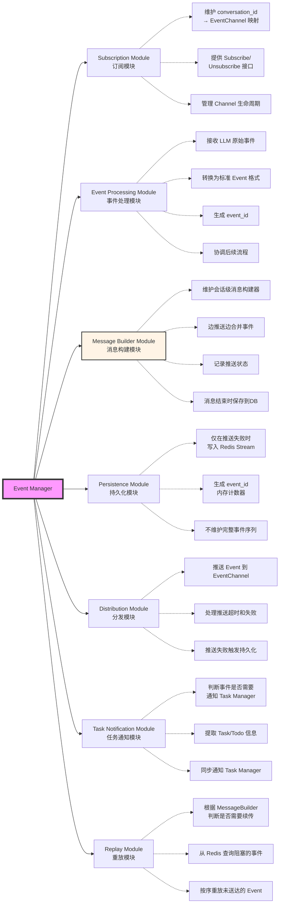

### 3.1.3 数据结构
#### Event 字段：
- event_id: int64（会话内递增，从1开始，内存计数器生成）
- conversation_id: string
- message_id: string
- task_id: string（可选）
- todo_id: string（可选）
- event_type: string（如 "LLM_CHUNK", "TOOL_CALL", "TASK_PLAN"等）
- event_data: map（动态结构，根据 event_type 不同）
- create_time: int64（毫秒时间戳）

特点：
- event_id 在同一会话内唯一且递增（所有事件都有）
- event_id 可直接用于排序和续传
- event_data 为松耦合设计，支持扩展
- 推送成功的事件不持久化到 Redis

#### MessageBuilder（消息构建器）

**作用**: 边推送边合并事件，在内存中构建完整消息
```
type MessageBuilder struct {
    // 基本信息
    ConversationID  string
    MessageID       string
    
    // 内容累加（边推送边合并）
    Content         strings.Builder  // 累加所有 LLM_CHUNK 的 content
    
    // 结构化数据
    ToolCalls       []ToolCall       // 收集所有 TOOL_CALL
    TaskInfo        *TaskPlan        // TASK_PLAN 事件
    
    // 元数据
    StartTime       time.Time
    Status          string           // "generating" | "completed" | "failed"
    ErrorReason     string           // 失败原因
    
    // 推送状态（不保存到 DB）
    LastPushedID    int64            // 最后成功推送的 event_id
    IsBlocked       bool             // 是否因推送失败而阻塞
    BlockedAt       int64            // 阻塞在哪个 event_id
    
    // 并发控制
    mu              sync.Mutex
}
```

**生命周期**:
- **创建**: 收到第一个 LLM 事件时
- **更新**: 每个事件到达时累加内容
- **推送状态更新**: 每次推送后更新 last_pushed_id 或标记阻塞
- **读取**: 消息结束时从 Builder 获取完整内容保存到 DB
- **清理**: 消息保存到 DB 后清理

#### Subscription Map（订阅映射）
类型：sync.Map（线程安全）

映射：conversation_id → chan Event
生命周期：
- 创建：Chat API 调用 Subscribe 时
- 销毁：Chat API 调用 Unsubscribe 时（比如会话结束）
- 存储位置：内存（不持久化）

### 3.1.4 核心方法设计

#### Subscribe (订阅与续传)

**功能**: 为指定会话创建事件订阅,并处理续传

**调用方**: Chat API

**输入**:
- conversation_id: string
- last_event_id: int64 (前端最后接收的 event_id, 0 表示新连接)

**输出**: eventChan (chan Event)

**处理流程**:
```
1. 获取消息构建器 (MessageBuilder)

2. 判断续传场景:
   
   场景A: builder 不存在
     → 无正在生成的消息
     → 创建 Channel,等待新消息
     → 返回 Channel
   
   场景B: builder 存在但未阻塞
     → 消息正在正常生成且推送正常
     → 创建 Channel,继续正常推送
     → 返回 Channel
   
   场景C: builder 存在且已阻塞 (is_blocked=true)
     → 之前推送失败,需要续传
     → 从 Redis 查询 event_id > builder.last_pushed_id 的事件
     → 如果 Redis 中有事件:
        - 创建 Channel
        - 启动协程按序重放事件
        - 重放完成后解除阻塞状态
     → 如果 Redis 中无事件（数据过期/丢失）:
        - 记录错误日志
        - 直接解除阻塞,继续正常流程
     → 返回 Channel

3. 返回 eventChan
```

#### Unsubscribe （取消订阅）

- 功能：取消订阅，关闭Channel
- 调用方：Chat API（defer调用）
- 输入：conversation_id
- 输出：无
- 副作用：关闭Channel，清理内存映射


#### ProcessLLMEvent (事件处理)

**功能**: 处理LLM Server返回的原始事件

**调用方**: LLM Proxy

**输入**:
- conversation_id: string
- message_id: string
- llm_event_data: map（原始数据，比如{id:"", delta:{content: "1"}, finish_reason: null}）

**输出**: error

**处理流程**: 
```
1. 生成 event_id (内存计数器,会话级递增)

2. 转换为标准Event

3. 更新 MessageBuilder:
   - 如果是 LLM_CHUNK: 累加 content
   - 如果是 TOOL_CALL: 追加到 tool_calls
   - 如果是 TASK_PLAN: 保存到 task_info

4. 检查是否可以推送:
   - 如果 builder.is_blocked=true: 不推送,直接持久化到 Redis
   - 如果 builder.is_blocked=false: 尝试推送

5. 尝试推送到 Channel:
   a. 推送成功:
      - 更新 builder.last_pushed_id
      - 不持久化到 Redis
   
   b. 推送失败/超时/Channel不存在:
      - 持久化到 Redis
      - 更新 builder.is_blocked=true
      - 记录 builder.blocked_at=event_id

6. 通知 Task Manager (如需要):
   - 同步调用 TaskManager.HandleEvent(event)

7. 检查是否消息结束 (finish_reason 存在):
   - 从 MessageBuilder 获取完整消息
   - 保存到 t_messages 表
   - 清理 MessageBuilder
```