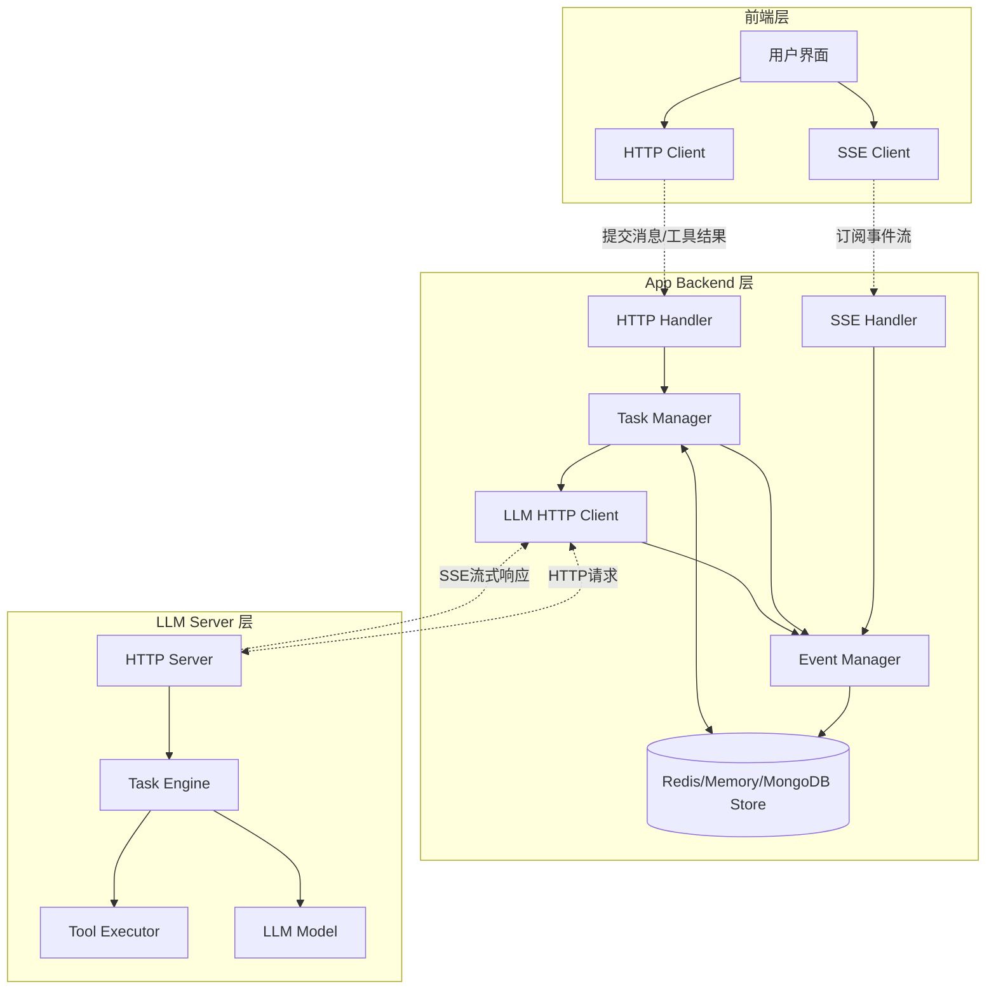

```mermaid
graph TB
    subgraph "前端层"
        UI[用户界面]
        SSE[SSE Client]
        HTTP[HTTP Client]
    end

    subgraph "App Backend 层"
        direction TB
        SSE_Handler[SSE Handler]
        HTTP_Handler[HTTP Handler]
        Event_Manager[Event Manager]
        Task_Manager[Task Manager]
        LLM_Client[LLM HTTP Client]
        Store[(Redis/Memory/MongoDB Store)]
    end

    subgraph "LLM Server 层"
        HTTP_Server[HTTP Server]
        Task_Engine[Task Engine]
        Tool_Executor[Tool Executor]
        Model[LLM Model]
    end

    UI --> SSE
    UI --> HTTP

    SSE -.订阅事件流.-> SSE_Handler
    HTTP -.提交消息/工具结果.-> HTTP_Handler

    SSE_Handler --> Event_Manager
    HTTP_Handler --> Task_Manager
    Task_Manager --> Event_Manager
    Task_Manager --> LLM_Client

    Event_Manager --> Store
    Task_Manager <--> Store

    LLM_Client <-.HTTP请求.-> HTTP_Server
    HTTP_Server -.SSE流式响应.-> LLM_Client
    LLM_Client --> Event_Manager

    HTTP_Server --> Task_Engine
    Task_Engine --> Tool_Executor
    Task_Engine --> Model
```