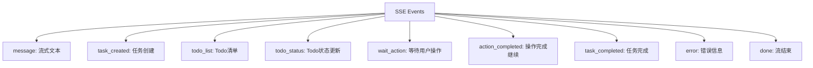

```mermaid
graph TD
    A[SSE Events] --> B[message: 流式文本]
    A --> C[task_created: 任务创建]
    A --> D[todo_list: Todo清单]
    A --> E[todo_status: Todo状态更新]
    A --> F[wait_action: 等待用户操作]
    A --> G[action_completed: 操作完成继续]
    A --> H[task_completed: 任务完成]
    A --> I[error: 错误信息]
    A --> J[done: 流结束]
```