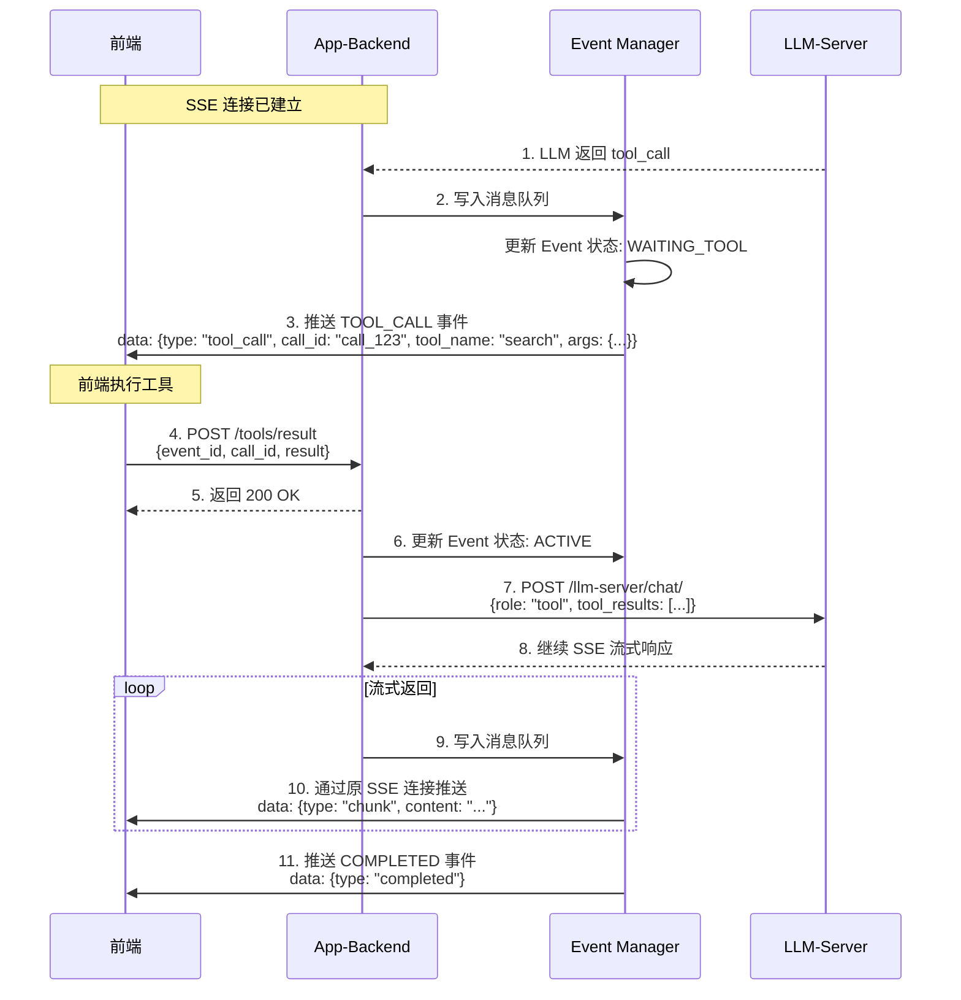

```mermaid
sequenceDiagram
    participant F as 前端
    participant B as App-Backend
    participant E as Event Manager
    participant L as LLM-Server

    Note over F,B: SSE 连接已建立
    
    L-->>B: 1. LLM 返回 tool_call
    B->>E: 2. 写入消息队列
    E->>E: 更新 Event 状态: WAITING_TOOL
    E->>F: 3. 推送 TOOL_CALL 事件<br/>data: {type: "tool_call", call_id: "call_123", tool_name: "search", args: {...}}
    
    Note over F: 前端执行工具
    
    F->>B: 4. POST /tools/result<br/>{event_id, call_id, result}
    B-->>F: 5. 返回 200 OK
    
    B->>E: 6. 更新 Event 状态: ACTIVE
    B->>L: 7. POST /llm-server/chat/<br/>{role: "tool", tool_results: [...]}
    
    L-->>B: 8. 继续 SSE 流式响应
    
    loop 流式返回
        B->>E: 9. 写入消息队列
        E->>F: 10. 通过原 SSE 连接推送<br/>data: {type: "chunk", content: "..."}
    end
    
    E->>F: 11. 推送 COMPLETED 事件<br/>data: {type: "completed"}
```