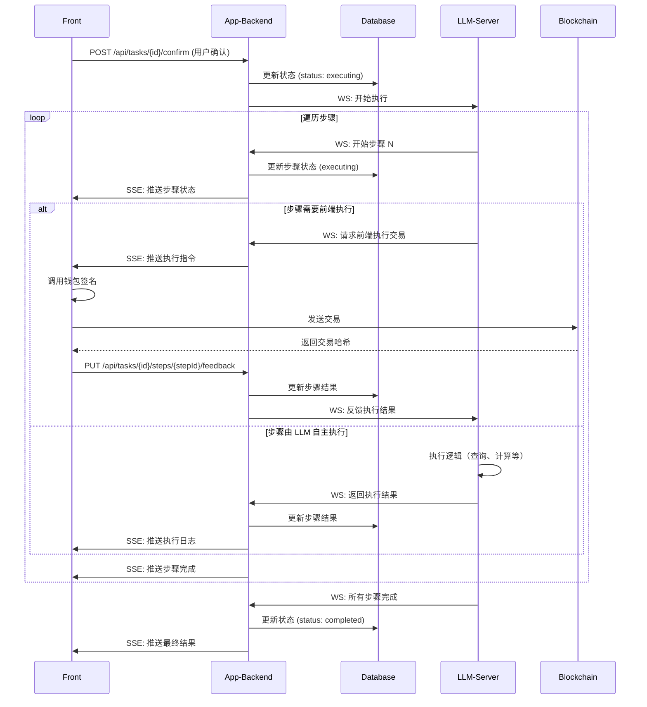

```mermaid
sequenceDiagram
    participant F as Front
    participant A as App-Backend
    participant D as Database
    participant L as LLM-Server
    participant B as Blockchain
    
    F->>A: POST /api/tasks/{id}/confirm (用户确认)
    A->>D: 更新状态 (status: executing)
    A->>L: WS: 开始执行
    
    loop 遍历步骤
        L->>A: WS: 开始步骤 N
        A->>D: 更新步骤状态 (executing)
        A->>F: SSE: 推送步骤状态
        
        alt 步骤需要前端执行
            L->>A: WS: 请求前端执行交易
            A->>F: SSE: 推送执行指令
            F->>F: 调用钱包签名
            F->>B: 发送交易
            B-->>F: 返回交易哈希
            F->>A: PUT /api/tasks/{id}/steps/{stepId}/feedback
            A->>D: 更新步骤结果
            A->>L: WS: 反馈执行结果
        else 步骤由 LLM 自主执行
            L->>L: 执行逻辑（查询、计算等）
            L->>A: WS: 返回执行结果
            A->>D: 更新步骤结果
            A->>F: SSE: 推送执行日志
        end
        
        A->>F: SSE: 推送步骤完成
    end
    
    L->>A: WS: 所有步骤完成
    A->>D: 更新状态 (status: completed)
    A->>F: SSE: 推送最终结果
```