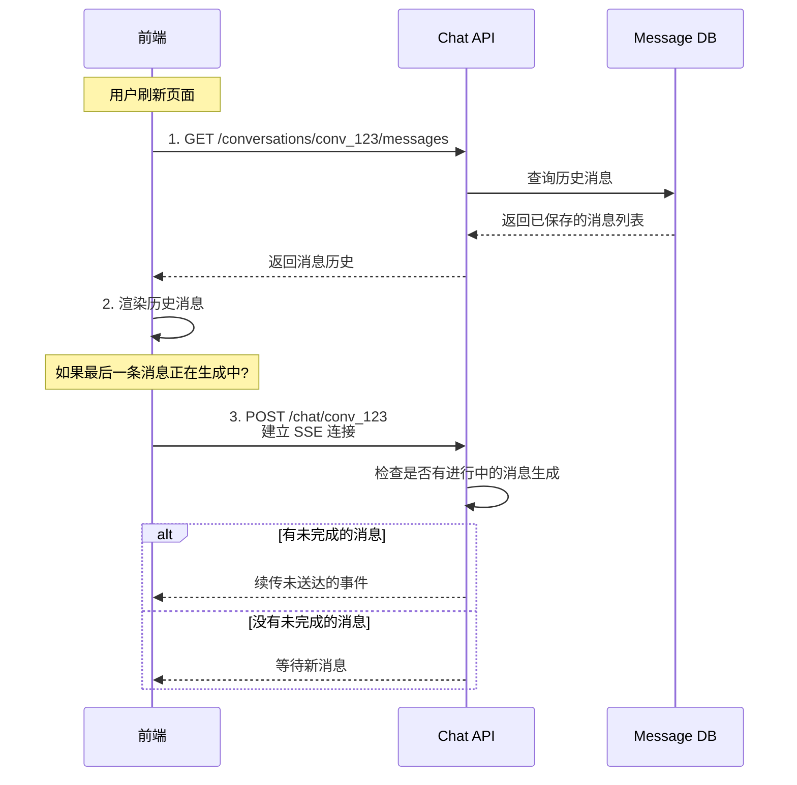

```mermaid
sequenceDiagram
    participant FE as 前端
    participant API as Chat API
    participant DB as Message DB
    
    Note over FE: 用户刷新页面
    
    FE->>API: 1. GET /conversations/conv_123/messages
    API->>DB: 查询历史消息
    DB-->>API: 返回已保存的消息列表
    API-->>FE: 返回消息历史
    
    FE->>FE: 2. 渲染历史消息
    
    Note over FE: 如果最后一条消息正在生成中?
    
    FE->>API: 3. POST /chat/conv_123<br/>建立 SSE 连接
    API->>API: 检查是否有进行中的消息生成
    
    alt 有未完成的消息
        API-->>FE: 续传未送达的事件
    else 没有未完成的消息
        API-->>FE: 等待新消息
    end
```