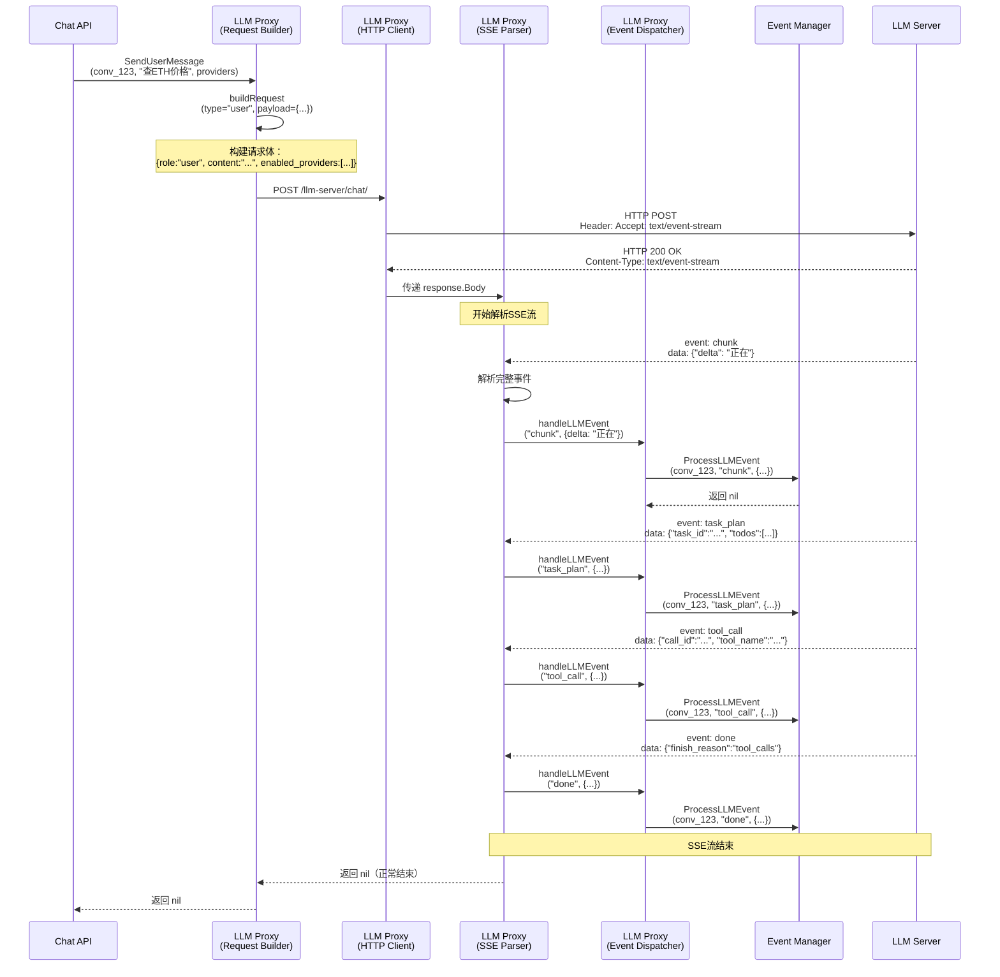

```mermaid
sequenceDiagram
    participant ChatAPI as Chat API
    participant LLMProxy as LLM Proxy<br/>(Request Builder)
    participant HTTPClient as LLM Proxy<br/>(HTTP Client)
    participant SSEParser as LLM Proxy<br/>(SSE Parser)
    participant EventDisp as LLM Proxy<br/>(Event Dispatcher)
    participant EventMgr as Event Manager
    participant LLM as LLM Server

    ChatAPI->>LLMProxy: SendUserMessage<br/>(conv_123, "查ETH价格", providers)
    
    LLMProxy->>LLMProxy: buildRequest<br/>(type="user", payload={...})
    Note over LLMProxy: 构建请求体：<br/>{role:"user", content:"...", enabled_providers:[...]}
    
    LLMProxy->>HTTPClient: POST /llm-server/chat/
    HTTPClient->>LLM: HTTP POST<br/>Header: Accept: text/event-stream
    
    LLM-->>HTTPClient: HTTP 200 OK<br/>Content-Type: text/event-stream
    
    HTTPClient->>SSEParser: 传递 response.Body
    
    Note over SSEParser: 开始解析SSE流
    
    LLM-->>SSEParser: event: chunk<br/>data: {"delta": "正在"}
    SSEParser->>SSEParser: 解析完整事件
    SSEParser->>EventDisp: handleLLMEvent<br/>("chunk", {delta: "正在"})
    EventDisp->>EventMgr: ProcessLLMEvent<br/>(conv_123, "chunk", {...})
    EventMgr-->>EventDisp: 返回 nil
    
    LLM-->>SSEParser: event: task_plan<br/>data: {"task_id":"...", "todos":[...]}
    SSEParser->>EventDisp: handleLLMEvent<br/>("task_plan", {...})
    EventDisp->>EventMgr: ProcessLLMEvent<br/>(conv_123, "task_plan", {...})
    
    LLM-->>SSEParser: event: tool_call<br/>data: {"call_id":"...", "tool_name":"..."}
    SSEParser->>EventDisp: handleLLMEvent<br/>("tool_call", {...})
    EventDisp->>EventMgr: ProcessLLMEvent<br/>(conv_123, "tool_call", {...})
    
    LLM-->>SSEParser: event: done<br/>data: {"finish_reason":"tool_calls"}
    SSEParser->>EventDisp: handleLLMEvent<br/>("done", {...})
    EventDisp->>EventMgr: ProcessLLMEvent<br/>(conv_123, "done", {...})
    
    Note over LLM,SSEParser: SSE流结束
    
    SSEParser-->>LLMProxy: 返回 nil（正常结束）
    LLMProxy-->>ChatAPI: 返回 nil
```