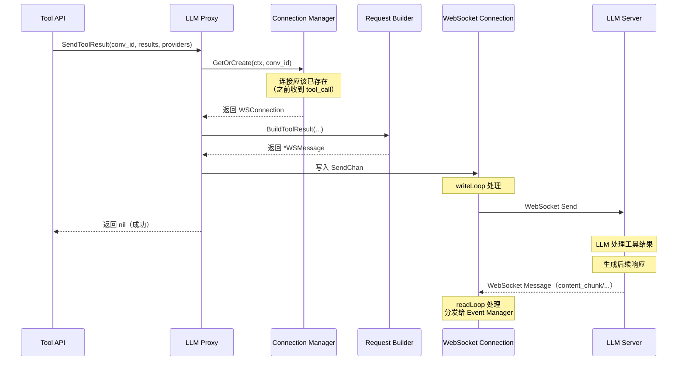

```mermaid
sequenceDiagram
    participant ToolAPI as Tool API
    participant LLMProxy as LLM Proxy
    participant ConnMgr as Connection Manager
    participant ReqBuilder as Request Builder
    participant WSConn as WebSocket Connection
    participant LLMServer as LLM Server

    ToolAPI->>LLMProxy: SendToolResult(conv_id, results, providers)
    
    LLMProxy->>ConnMgr: GetOrCreate(ctx, conv_id)
    
    Note over ConnMgr: 连接应该已存在<br/>（之前收到 tool_call）
    
    ConnMgr-->>LLMProxy: 返回 WSConnection
    
    LLMProxy->>ReqBuilder: BuildToolResult(...)
    ReqBuilder-->>LLMProxy: 返回 *WSMessage
    
    LLMProxy->>WSConn: 写入 SendChan
    
    Note over WSConn: writeLoop 处理
    WSConn->>LLMServer: WebSocket Send
    
    LLMProxy-->>ToolAPI: 返回 nil（成功）
    
    Note over LLMServer: LLM 处理工具结果
    Note over LLMServer: 生成后续响应
    
    LLMServer-->>WSConn: WebSocket Message（content_chunk/...）
    
    Note over WSConn: readLoop 处理<br/>分发给 Event Manager
```