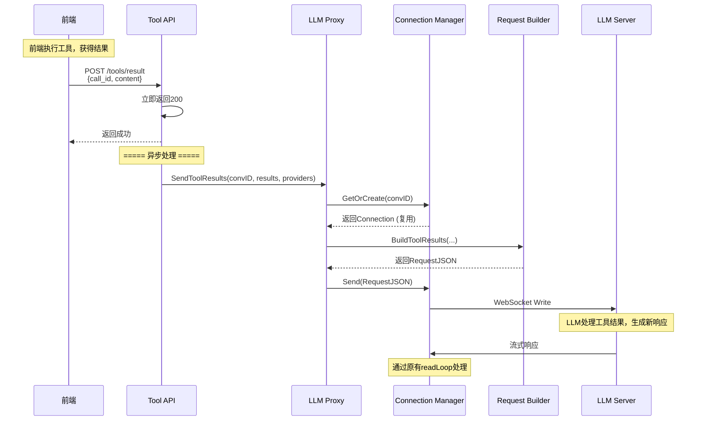

```mermaid
sequenceDiagram
    participant FE as 前端
    participant ToolAPI as Tool API
    participant Proxy as LLM Proxy
    participant ConnMgr as Connection Manager
    participant Builder as Request Builder
    participant LLM as LLM Server
    
    Note over FE: 前端执行工具，获得结果
    
    FE->>ToolAPI: POST /tools/result<br/>{call_id, content}
    ToolAPI->>ToolAPI: 立即返回200
    ToolAPI-->>FE: 返回成功
    
    Note over ToolAPI: ===== 异步处理 =====
    
    ToolAPI->>Proxy: SendToolResults(convID, results, providers)
    Proxy->>ConnMgr: GetOrCreate(convID)
    ConnMgr-->>Proxy: 返回Connection (复用)
    
    Proxy->>Builder: BuildToolResults(...)
    Builder-->>Proxy: 返回RequestJSON
    
    Proxy->>ConnMgr: Send(RequestJSON)
    ConnMgr->>LLM: WebSocket Write
    
    Note over LLM: LLM处理工具结果，生成新响应
    
    LLM->>ConnMgr: 流式响应
    Note over ConnMgr: 通过原有readLoop处理
```