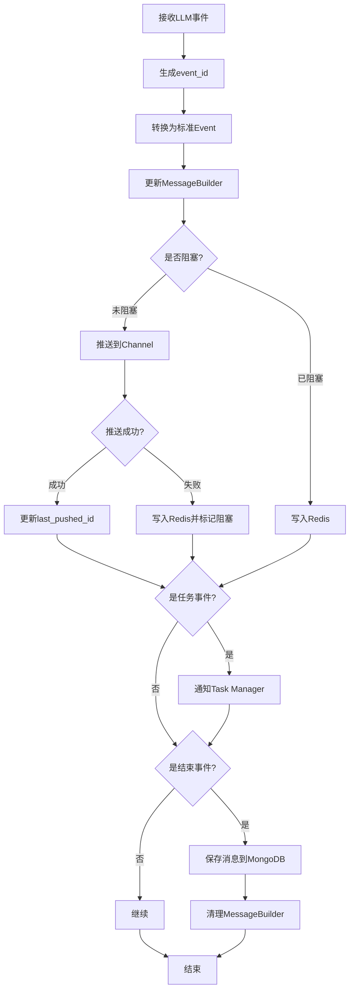

```mermaid
graph TD
    A[接收LLM事件] --> B[生成event_id]
    B --> C[转换为标准Event]
    C --> D[更新MessageBuilder]
    D --> E{是否阻塞?}
    E -->|未阻塞| F[推送到Channel]
    E -->|已阻塞| G[写入Redis]
    F --> H{推送成功?}
    H -->|成功| I[更新last_pushed_id]
    H -->|失败| J[写入Redis并标记阻塞]
    I --> K{是任务事件?}
    J --> K
    G --> K
    K -->|是| L[通知Task Manager]
    K -->|否| M{是结束事件?}
    L --> M
    M -->|是| N[保存消息到MongoDB]
    M -->|否| O[继续]
    N --> P[清理MessageBuilder]
    O --> Q[结束]
    P --> Q
```