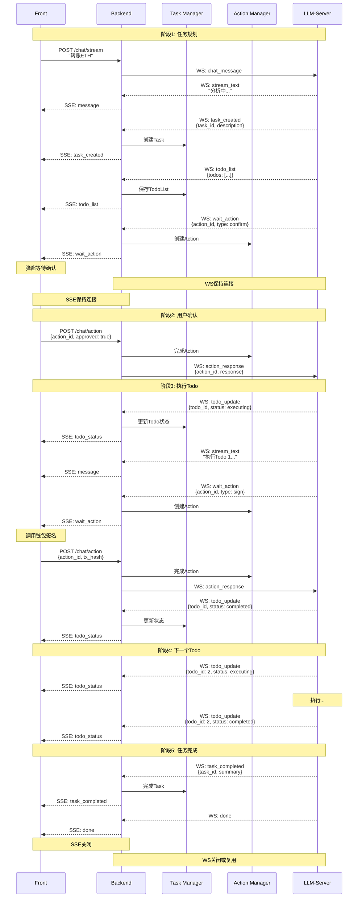

```mermaid
sequenceDiagram
    participant F as Front
    participant B as Backend
    participant TM as Task Manager
    participant AM as Action Manager
    participant L as LLM-Server
    
    Note over F,L: 阶段1: 任务规划
    
    F->>B: POST /chat/stream<br/>"转账ETH"
    B->>L: WS: chat_message
    
    L-->>B: WS: stream_text<br/>"分析中..."
    B-->>F: SSE: message
    
    L-->>B: WS: task_created<br/>{task_id, description}
    B->>TM: 创建Task
    B-->>F: SSE: task_created
    
    L-->>B: WS: todo_list<br/>{todos: [...]}
    B->>TM: 保存TodoList
    B-->>F: SSE: todo_list
    
    L-->>B: WS: wait_action<br/>{action_id, type: confirm}
    B->>AM: 创建Action
    B-->>F: SSE: wait_action
    
    Note over F: 弹窗等待确认
    Note over B,L: WS保持连接
    Note over F,B: SSE保持连接
    
    Note over F,L: 阶段2: 用户确认
    
    F->>B: POST /chat/action<br/>{action_id, approved: true}
    B->>AM: 完成Action
    B->>L: WS: action_response<br/>{action_id, response}
    
    Note over F,L: 阶段3: 执行Todo
    
    L-->>B: WS: todo_update<br/>{todo_id, status: executing}
    B->>TM: 更新Todo状态
    B-->>F: SSE: todo_status
    
    L-->>B: WS: stream_text<br/>"执行Todo 1..."
    B-->>F: SSE: message
    
    L-->>B: WS: wait_action<br/>{action_id, type: sign}
    B->>AM: 创建Action
    B-->>F: SSE: wait_action
    
    Note over F: 调用钱包签名
    
    F->>B: POST /chat/action<br/>{action_id, tx_hash}
    B->>AM: 完成Action
    B->>L: WS: action_response
    
    L-->>B: WS: todo_update<br/>{todo_id, status: completed}
    B->>TM: 更新状态
    B-->>F: SSE: todo_status
    
    Note over F,L: 阶段4: 下一个Todo
    
    L-->>B: WS: todo_update<br/>{todo_id: 2, status: executing}
    B-->>F: SSE: todo_status
    
    Note over L: 执行...
    
    L-->>B: WS: todo_update<br/>{todo_id: 2, status: completed}
    B-->>F: SSE: todo_status
    
    Note over F,L: 阶段5: 任务完成
    
    L-->>B: WS: task_completed<br/>{task_id, summary}
    B->>TM: 完成Task
    B-->>F: SSE: task_completed
    
    L-->>B: WS: done
    B-->>F: SSE: done
    
    Note over F,B: SSE关闭
    Note over B,L: WS关闭或复用
```