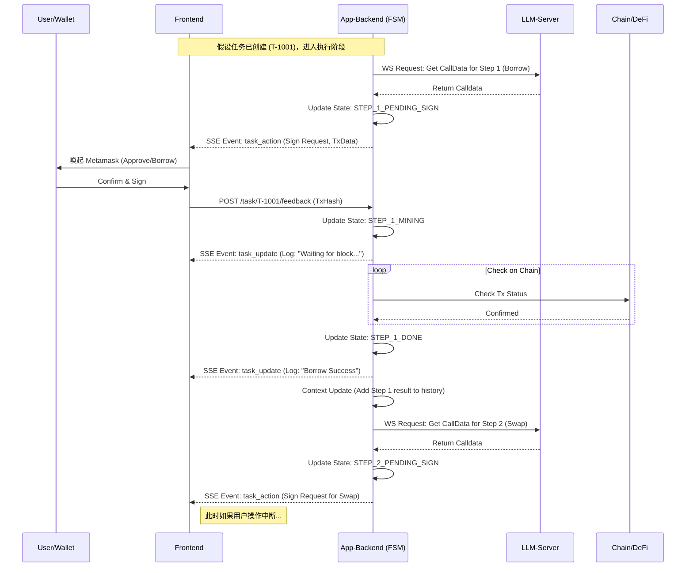

```mermaid
sequenceDiagram
    participant U as User/Wallet
    participant F as Frontend
    participant B as App-Backend (FSM)
    participant L as LLM-Server
    participant C as Chain/DeFi

    Note over F, B: 假设任务已创建 (T-1001)，进入执行阶段
    
    %% Step 1: 借款
    B->>L: WS Request: Get CallData for Step 1 (Borrow)
    L-->>B: Return Calldata
    B->>B: Update State: STEP_1_PENDING_SIGN
    B-->>F: SSE Event: task_action (Sign Request, TxData)
    
    F->>U: 唤起 Metamask (Approve/Borrow)
    U->>F: Confirm & Sign
    F->>B: POST /task/T-1001/feedback (TxHash)
    
    B->>B: Update State: STEP_1_MINING
    B-->>F: SSE Event: task_update (Log: "Waiting for block...")
    
    loop Check on Chain
        B->>C: Check Tx Status
        C-->>B: Confirmed
    end
    
    B->>B: Update State: STEP_1_DONE
    B-->>F: SSE Event: task_update (Log: "Borrow Success")

    %% Step 2: Swap (串行逻辑)
    B->>B: Context Update (Add Step 1 result to history)
    B->>L: WS Request: Get CallData for Step 2 (Swap)
    L-->>B: Return Calldata
    B->>B: Update State: STEP_2_PENDING_SIGN
    B-->>F: SSE Event: task_action (Sign Request for Swap)
    
    Note right of F: 此时如果用户操作中断...
```