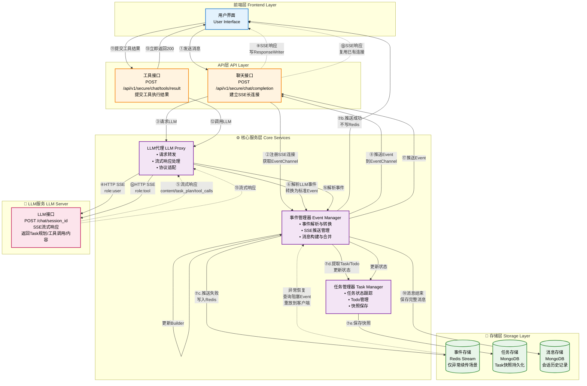

```mermaid
graph TB
    %% ========== 前端层 ==========
    subgraph Frontend["前端层 Frontend Layer"]
        UI[用户界面<br/>User Interface]
    end
    
    %% ========== API层 ==========
    subgraph APILayer["API层 API Layer"]
        ChatAPI["聊天接口<br/>POST /api/v1/secure/chat/completion<br/>建立SSE长连接"]
        ToolAPI["工具接口<br/>POST /api/v1/secure/chat/tools/result<br/>提交工具执行结果"]
    end
    
    %% ========== 核心服务层 ==========
    subgraph CoreServices["⚙️ 核心服务层 Core Services"]
        EventMgr["事件管理器 Event Manager<br/>• 事件解析与转换<br/>• SSE推送管理<br/>• 消息构建与合并"]
        TaskMgr["任务管理器 Task Manager<br/>• 任务状态跟踪<br/>• Todo管理<br/>• 快照保存"]
        LLMProxy["LLM代理 LLM Proxy<br/>• 请求转发<br/>• 流式响应处理<br/>• 协议适配"]
    end
    
    %% ========== 存储层 ==========
    subgraph StorageLayer["💾 存储层 Storage Layer"]
        EventStore[("事件存储<br/>Redis Stream<br/>仅异常续传场景")]
        TaskStore[("任务存储<br/>MongoDB<br/>Task快照持久化")]
        MessageStore[("消息存储<br/>MongoDB<br/>会话历史记录")]
    end
    
    %% ========== LLM服务 ==========
    subgraph LLMService["🤖 LLM服务 LLM Server"]
        LLMAPI["LLM接口<br/>POST /chat/session_id<br/>SSE流式响应<br/>返回Task规划/工具调用/内容"]
    end
    
    %% ========== 主流程：用户消息 ==========
    UI -->|"①发送消息"| ChatAPI
    ChatAPI -->|"②注册SSE连接<br/>获取EventChannel"| EventMgr
    ChatAPI -->|"③请求LLM"| LLMProxy
    
    LLMProxy -->|"④HTTP SSE<br/>role:user"| LLMAPI
    LLMAPI -.->|"⑤流式响应<br/>content/task_plan/tool_calls"| LLMProxy
    
    LLMProxy -->|"⑥解析LLM事件<br/>转换为标准Event"| EventMgr
    
    EventMgr -->|"⑦a.更新MessageBuilder<br/>边推送边合并"| EventMgr
    EventMgr -->|"⑦b.推送成功<br/>不写Redis"| UI
    EventMgr -->|"⑦c.推送失败<br/>写入Redis"| EventStore
    EventMgr -->|"⑦d.提取Task/Todo<br/>更新状态"| TaskMgr
    
    TaskMgr -->|"⑦e.保存快照"| TaskStore
    EventMgr -->|"⑧推送Event<br/>到EventChannel"| ChatAPI
    ChatAPI -.->|"⑨SSE响应<br/>写ResponseWriter"| UI
    EventMgr -->|"⑩消息结束<br/>保存完整消息"| MessageStore
    
    %% ========== 工具调用流程 ==========
    UI -->|"⑪提交工具结果"| ToolAPI
    ToolAPI -->|"⑫调用LLM"| LLMProxy
    ToolAPI -->|"⑬立即返回200"| UI
    
    LLMProxy -->|"⑭HTTP SSE<br/>role:tool"| LLMAPI
    LLMAPI -.->|"⑮流式响应"| LLMProxy
    
    LLMProxy -->|"⑯解析事件"| EventMgr
    EventMgr -->|"更新Builder"| EventMgr
    EventMgr -->|"更新状态"| TaskMgr
    EventMgr -->|"⑰推送Event"| ChatAPI
    ChatAPI -.->|"⑱SSE响应<br/>复用已有连接"| UI
    
    %% ========== 异常续传 ==========
    EventStore -.->|"异常恢复<br/>查询阻塞Event<br/>重放到客户端"| EventMgr
    
    %% ========== 样式定义 ==========
    classDef frontendStyle fill:#E3F2FD,stroke:#1976D2,stroke-width:2px,color:#000
    classDef apiStyle fill:#FFF3E0,stroke:#F57C00,stroke-width:2px,color:#000
    classDef serviceStyle fill:#F3E5F5,stroke:#7B1FA2,stroke-width:2px,color:#000
    classDef storageStyle fill:#E8F5E9,stroke:#388E3C,stroke-width:2px,color:#000
    classDef llmStyle fill:#FCE4EC,stroke:#C2185B,stroke-width:2px,color:#000
    
    class UI frontendStyle
    class ChatAPI,ToolAPI apiStyle
    class EventMgr,TaskMgr,LLMProxy serviceStyle
    class EventStore,TaskStore,MessageStore storageStyle
    class LLMAPI llmStyle
```