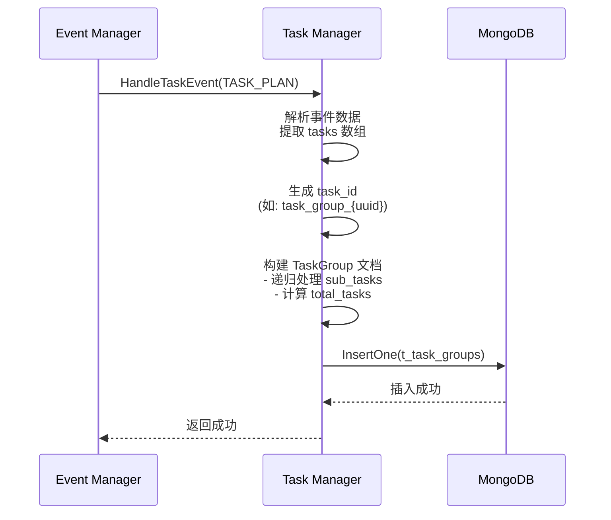

```mermaid
sequenceDiagram
    participant EM as Event Manager
    participant TM as Task Manager
    participant DB as MongoDB
    
    EM->>TM: HandleTaskEvent(TASK_PLAN)
    
    TM->>TM: 解析事件数据<br/>提取 tasks 数组
    
    TM->>TM: 生成 task_id<br/>(如: task_group_{uuid})
    
    TM->>TM: 构建 TaskGroup 文档<br/>- 递归处理 sub_tasks<br/>- 计算 total_tasks
    
    TM->>DB: InsertOne(t_task_groups)
    
    DB-->>TM: 插入成功
    
    TM-->>EM: 返回成功
```