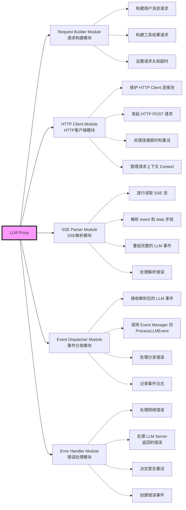

```mermaid
graph LR
    LP[LLM Proxy]
    
    LP --> RBM[Request Builder Module<br/>请求构建模块]
    LP --> HCM[HTTP Client Module<br/>HTTP客户端模块]
    LP --> SPM[SSE Parser Module<br/>SSE解析模块]
    LP --> EDM[Event Dispatcher Module<br/>事件分发模块]
    LP --> EHM[Error Handler Module<br/>错误处理模块]
    
    RBM -.-> RBM1[构建用户消息请求]
    RBM -.-> RBM2[构建工具结果请求]
    RBM -.-> RBM3[设置请求头和超时]
    
    HCM -.-> HCM1[维护 HTTP Client 连接池]
    HCM -.-> HCM2[发起 HTTP POST 请求]
    HCM -.-> HCM3[处理连接超时和重试]
    HCM -.-> HCM4[管理请求上下文 Context]
    
    SPM -.-> SPM1[逐行读取 SSE 流]
    SPM -.-> SPM2[解析 event 和 data 字段]
    SPM -.-> SPM3[重组完整的 LLM 事件]
    SPM -.-> SPM4[处理解析错误]
    
    EDM -.-> EDM1[接收解析后的 LLM 事件]
    EDM -.-> EDM2[调用 Event Manager 的<br/>ProcessLLMEvent]
    EDM -.-> EDM3[处理分发错误]
    EDM -.-> EDM4[记录事件日志]
    
    EHM -.-> EHM1[处理网络错误]
    EHM -.-> EHM2[处理 LLM Server<br/>返回的错误]
    EHM -.-> EHM3[决定是否重试]
    EHM -.-> EHM4[创建错误事件]
    
    style LP fill:#f9f,stroke:#333,stroke-width:4px
```