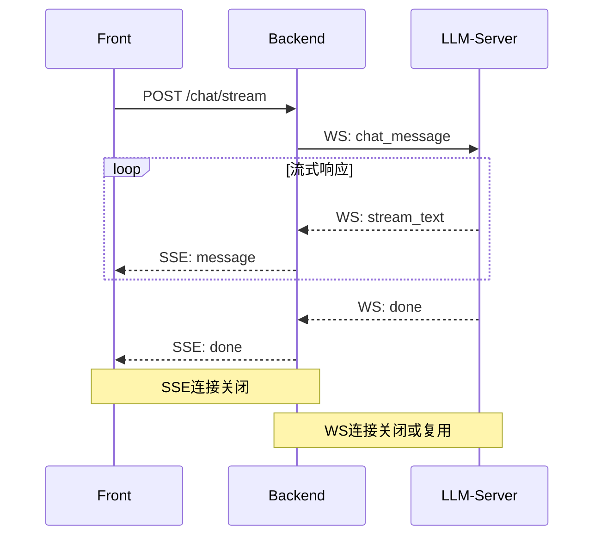

```mermaid
sequenceDiagram
    participant F as Front
    participant B as Backend
    participant L as LLM-Server
    
    F->>B: POST /chat/stream
    B->>L: WS: chat_message
    
    loop 流式响应
        L-->>B: WS: stream_text
        B-->>F: SSE: message
    end
    
    L-->>B: WS: done
    B-->>F: SSE: done
    
    Note over F,B: SSE连接关闭
    Note over B,L: WS连接关闭或复用
```