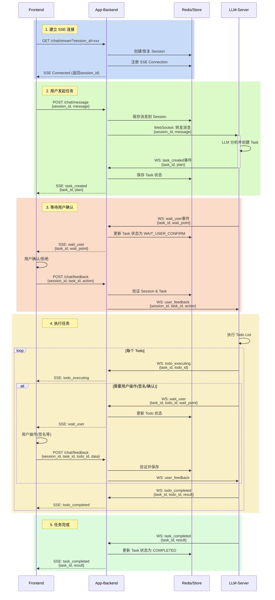

```mermaid
sequenceDiagram
    participant F as Frontend
    participant B as App-Backend
    participant R as Redis/Store
    participant L as LLM-Server
    
    rect rgb(200, 220, 250)
    note right of F: 1. 建立 SSE 连接
    F->>+B: GET /chat/stream?session_id=xxx
    B->>R: 创建/恢复 Session
    B->>R: 注册 SSE Connection
    B-->>F: SSE Connected (返回session_id)
    end
    
    rect rgb(220, 250, 200)
    note right of F: 2. 用户发起任务
    F->>B: POST /chat/message<br/>{session_id, message}
    B->>R: 保存消息到 Session
    B->>+L: WebSocket: 转发消息<br/>{session_id, message}
    L->>L: LLM 分析并创建 Task
    L->>-B: WS: task_created事件<br/>{task_id, plan}
    B->>R: 保存 Task 状态
    B-->>F: SSE: task_created<br/>{task_id, plan}
    end
    
    rect rgb(250, 220, 200)
    note right of F: 3. 等待用户确认
    L->>B: WS: wait_user事件<br/>{task_id, wait_point}
    B->>R: 更新 Task 状态为 WAIT_USER_CONFIRM
    B-->>F: SSE: wait_user<br/>{task_id, wait_point}
    
    F->>F: 用户确认/拒绝
    F->>B: POST /chat/feedback<br/>{session_id, task_id, action}
    B->>R: 验证 Session & Task
    B->>L: WS: user_feedback<br/>{session_id, task_id, action}
    end
    
    rect rgb(250, 240, 200)
    note right of F: 4. 执行任务
    L->>L: 执行 Todo List
    loop 每个 Todo
        L->>B: WS: todo_executing<br/>{task_id, todo_id}
        B-->>F: SSE: todo_executing
        
        alt 需要用户操作(签名/确认)
            L->>B: WS: wait_user<br/>{task_id, todo_id, wait_point}
            B->>R: 更新 Todo 状态
            B-->>F: SSE: wait_user
            
            F->>F: 用户操作(签名等)
            F->>B: POST /chat/feedback<br/>{session_id, task_id, todo_id, data}
            B->>R: 验证并保存
            B->>L: WS: user_feedback
        end
        
        L->>B: WS: todo_completed<br/>{task_id, todo_id, result}
        B-->>F: SSE: todo_completed
    end
    end
    
    rect rgb(220, 250, 220)
    note right of F: 5. 任务完成
    L->>B: WS: task_completed<br/>{task_id, result}
    B->>R: 更新 Task 状态为 COMPLETED
    B-->>F: SSE: task_completed<br/>{task_id, result}
    end
```