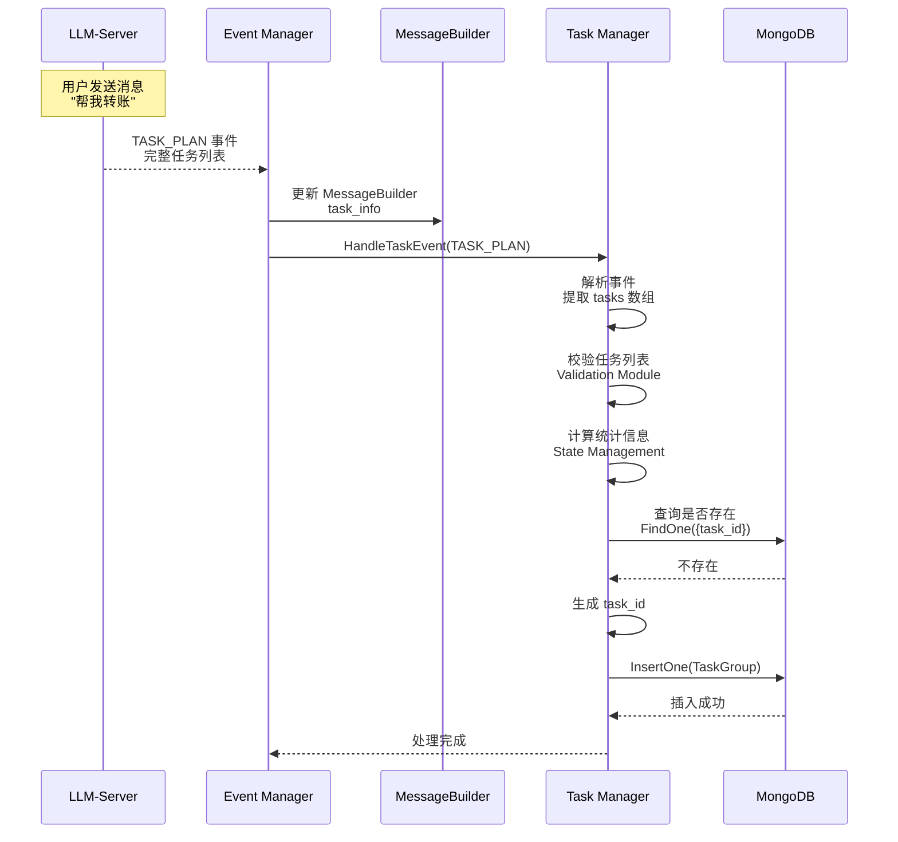

```mermaid
sequenceDiagram
    participant LLM as LLM-Server
    participant EM as Event Manager
    participant Builder as MessageBuilder
    participant TM as Task Manager
    participant DB as MongoDB
    
    Note over LLM: 用户发送消息<br/>"帮我转账"
    
    LLM-->>EM: TASK_PLAN 事件<br/>完整任务列表
    
    EM->>Builder: 更新 MessageBuilder<br/>task_info
    
    EM->>TM: HandleTaskEvent(TASK_PLAN)
    
    TM->>TM: 解析事件<br/>提取 tasks 数组
    
    TM->>TM: 校验任务列表<br/>Validation Module
    
    TM->>TM: 计算统计信息<br/>State Management
    
    TM->>DB: 查询是否存在<br/>FindOne({task_id})
    
    DB-->>TM: 不存在
    
    TM->>TM: 生成 task_id
    
    TM->>DB: InsertOne(TaskGroup)
    
    DB-->>TM: 插入成功
    
    TM-->>EM: 处理完成
```