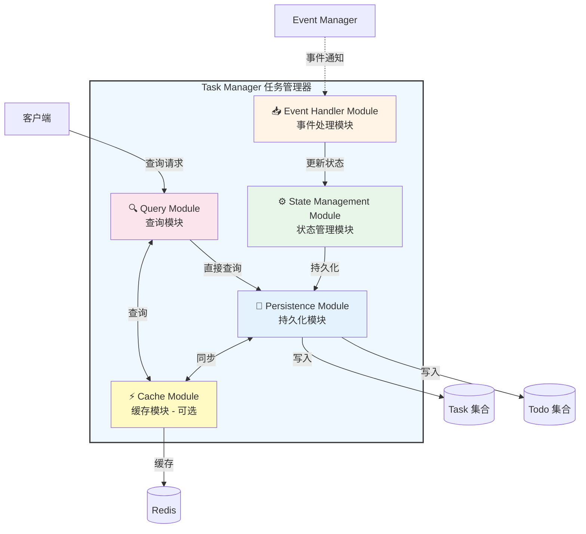

```mermaid
graph TB
    subgraph TM[Task Manager 任务管理器]
        direction TB
        
        EHM[📥 Event Handler Module<br/>事件处理模块]
        SMM[⚙️ State Management Module<br/>状态管理模块]
        PEM[💾 Persistence Module<br/>持久化模块]
        QM[🔍 Query Module<br/>查询模块]
        CM[⚡ Cache Module<br/>缓存模块 - 可选]
        
        EHM -->|更新状态| SMM
        SMM -->|持久化| PEM
        PEM <-->|同步| CM
        QM <-->|查询| CM
        QM -->|直接查询| PEM
    end
    
    EM[Event Manager] -.->|事件通知| EHM
    
    PEM -->|写入| DB1[(Task 集合)]
    PEM -->|写入| DB2[(Todo 集合)]
    
    CM -->|缓存| Redis[(Redis)]
    
    Client[客户端] -->|查询请求| QM
    
    style TM fill:#f0f8ff,stroke:#333,stroke-width:2px
    style EHM fill:#fff4e6
    style SMM fill:#e8f5e9
    style PEM fill:#e3f2fd
    style QM fill:#fce4ec
    style CM fill:#fff9c4
```