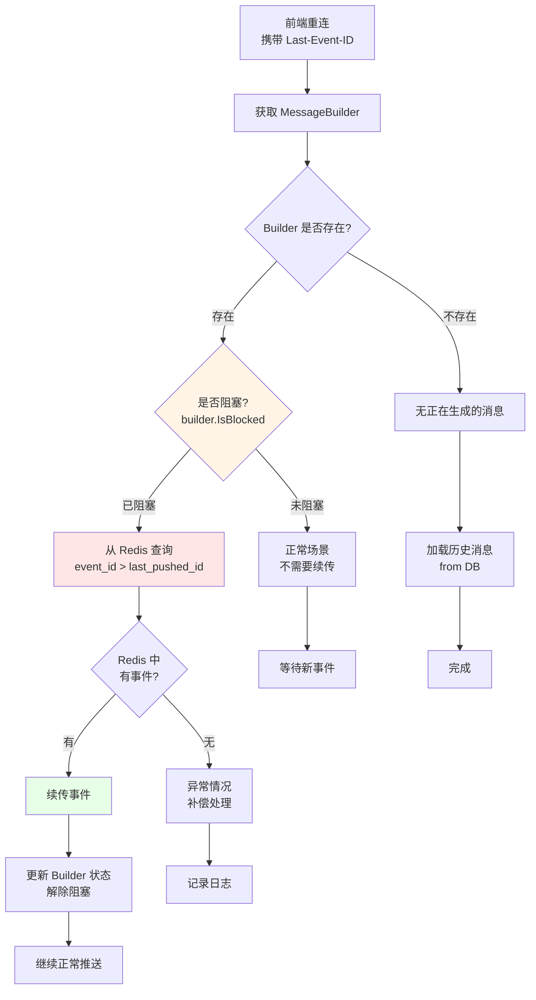

```mermaid
graph TB
    Reconnect[前端重连<br/>携带 Last-Event-ID]
    
    Reconnect --> GetBuilder[获取 MessageBuilder]
    
    GetBuilder --> CheckBuilder{Builder 是否存在?}
    
    CheckBuilder -->|不存在| NoGeneration[无正在生成的消息]
    CheckBuilder -->|存在| CheckBlocked{是否阻塞?<br/>builder.IsBlocked}
    
    NoGeneration --> LoadHistory[加载历史消息<br/>from DB]
    
    CheckBlocked -->|未阻塞| NormalReplay[正常场景<br/>不需要续传]
    
    CheckBlocked -->|已阻塞| CheckRedis[从 Redis 查询<br/>event_id > last_pushed_id]
    
    CheckRedis --> HasEvents{Redis 中<br/>有事件?}
    
    HasEvents -->|有| Replay[续传事件]
    HasEvents -->|无| Compensate[异常情况<br/>补偿处理]
    
    Replay --> UpdateBuilder[更新 Builder 状态<br/>解除阻塞]
    
    NormalReplay --> Done1[等待新事件]
    UpdateBuilder --> Done2[继续正常推送]
    LoadHistory --> Done3[完成]
    Compensate --> Done4[记录日志]
    
    style CheckBlocked fill:#fff4e6
    style CheckRedis fill:#ffe6e6
    style Replay fill:#e6ffe6
```