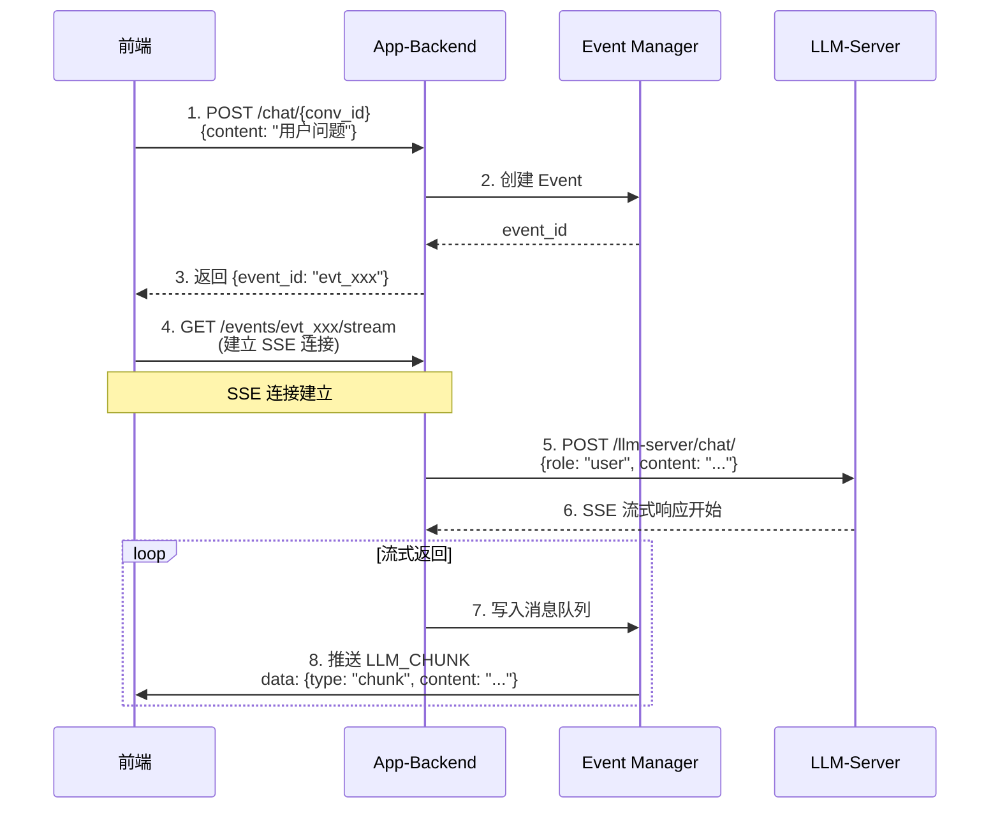

```mermaid
sequenceDiagram
    participant F as 前端
    participant B as App-Backend
    participant E as Event Manager
    participant L as LLM-Server

    F->>B: 1. POST /chat/{conv_id}<br/>{content: "用户问题"}
    B->>E: 2. 创建 Event
    E-->>B: event_id
    B-->>F: 3. 返回 {event_id: "evt_xxx"}
    
    F->>B: 4. GET /events/evt_xxx/stream<br/>(建立 SSE 连接)
    Note over F,B: SSE 连接建立
    
    B->>L: 5. POST /llm-server/chat/<br/>{role: "user", content: "..."}
    L-->>B: 6. SSE 流式响应开始
    
    loop 流式返回
        B->>E: 7. 写入消息队列
        E->>F: 8. 推送 LLM_CHUNK<br/>data: {type: "chunk", content: "..."}
    end
```