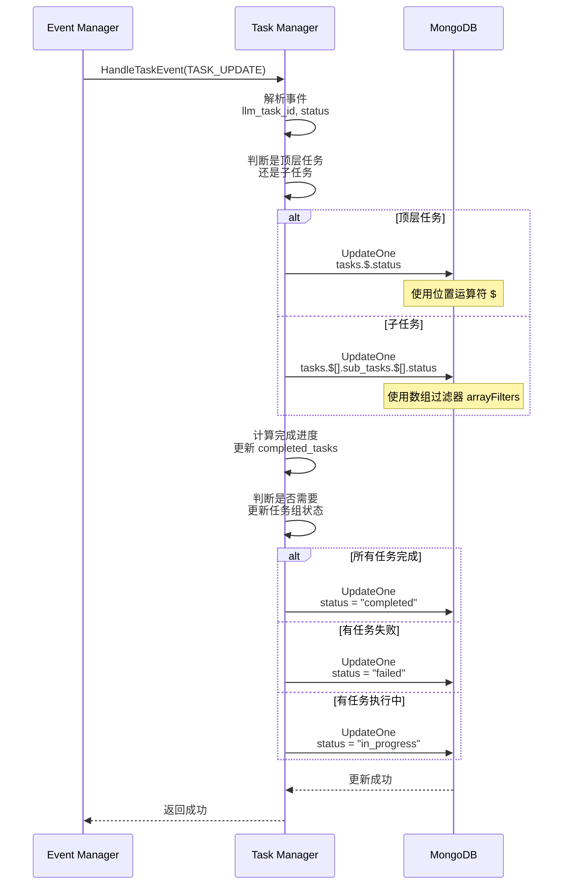

```mermaid
sequenceDiagram
    participant EM as Event Manager
    participant TM as Task Manager
    participant DB as MongoDB
    
    EM->>TM: HandleTaskEvent(TASK_UPDATE)
    
    TM->>TM: 解析事件<br/>llm_task_id, status
    
    TM->>TM: 判断是顶层任务<br/>还是子任务
    
    alt 顶层任务
        TM->>DB: UpdateOne<br/>tasks.$.status
        Note over DB: 使用位置运算符 $
    else 子任务
        TM->>DB: UpdateOne<br/>tasks.$[].sub_tasks.$[].status
        Note over DB: 使用数组过滤器 arrayFilters
    end
    
    TM->>TM: 计算完成进度<br/>更新 completed_tasks
    
    TM->>TM: 判断是否需要<br/>更新任务组状态
    
    alt 所有任务完成
        TM->>DB: UpdateOne<br/>status = "completed"
    else 有任务失败
        TM->>DB: UpdateOne<br/>status = "failed"
    else 有任务执行中
        TM->>DB: UpdateOne<br/>status = "in_progress"
    end
    
    DB-->>TM: 更新成功
    TM-->>EM: 返回成功
```