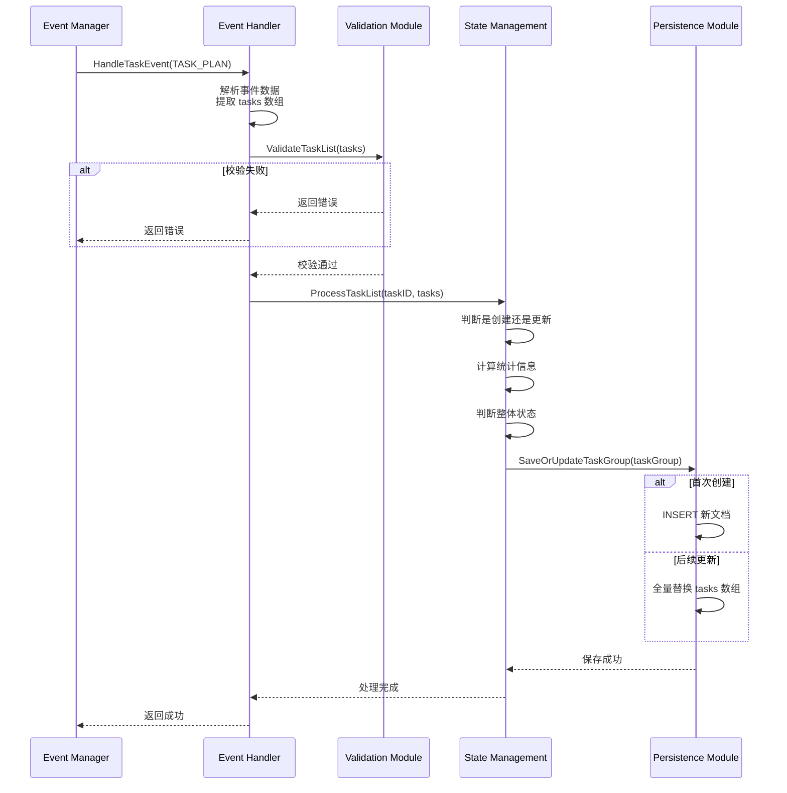

```mermaid
sequenceDiagram
    participant EM as Event Manager
    participant EHM as Event Handler
    participant VM as Validation Module
    participant SMM as State Management
    participant PM as Persistence Module
    
    EM->>EHM: HandleTaskEvent(TASK_PLAN)
    
    EHM->>EHM: 解析事件数据<br/>提取 tasks 数组
    
    EHM->>VM: ValidateTaskList(tasks)
    
    alt 校验失败
        VM-->>EHM: 返回错误
        EHM-->>EM: 返回错误
    end
    
    VM-->>EHM: 校验通过
    
    EHM->>SMM: ProcessTaskList(taskID, tasks)
    
    SMM->>SMM: 判断是创建还是更新
    SMM->>SMM: 计算统计信息
    SMM->>SMM: 判断整体状态
    
    SMM->>PM: SaveOrUpdateTaskGroup(taskGroup)
    
    alt 首次创建
        PM->>PM: INSERT 新文档
    else 后续更新
        PM->>PM: 全量替换 tasks 数组
    end
    
    PM-->>SMM: 保存成功
    SMM-->>EHM: 处理完成
    EHM-->>EM: 返回成功
```